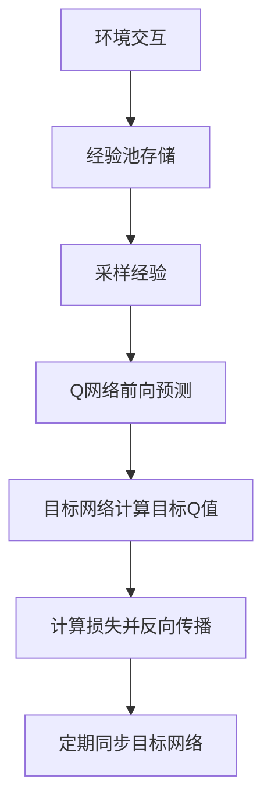

当然可以！下面用一个**具体数字的例子**，详细介绍DQN的训练流程和数据流。  
我们假设一个极简环境：  
- 状态 \(S_1, S_2\)  
- 动作 \(A_1, A_2\)  
- Q网络输入状态，输出两个动作的Q值  
- 经验池最多存5条  
- 学习率 \(\alpha=0.5\)，折扣因子 \(\gamma=0.9\)  
- 目标网络每2步同步一次

---

## 1. **初始化**

- 当前Q网络参数 \(\theta\)：初始Q值全为0
- 目标Q网络参数 \(\theta'\)：初始Q值全为0
- 经验池为空

---

## 2. **与环境交互并存储经验**

假设前4步与环境交互如下：

| 步数 | 当前状态 | 动作 | 奖励 | 下一个状态 |
|------|----------|------|------|------------|
| 1    | \(S_1\)  | \(A_1\) | 1  | \(S_2\)    |
| 2    | \(S_2\)  | \(A_2\) | 2  | \(S_1\)    |
| 3    | \(S_1\)  | \(A_2\) | 0  | \(S_2\)    |
| 4    | \(S_2\)  | \(A_1\) | 1  | \(S_2\)    |

经验池内容（每步后加入一条）：

1. \((S_1, A_1, 1, S_2)\)
2. \((S_2, A_2, 2, S_1)\)
3. \((S_1, A_2, 0, S_2)\)
4. \((S_2, A_1, 1, S_2)\)

---

## 3. **采样经验并训练Q网络**

假设第5步开始训练，每次从经验池随机采样一条数据。

### **第5步：采样 \((S_1, A_1, 1, S_2)\)**

- 当前Q网络：\(Q_\theta(S_1, A_1) = 0\)
- 目标Q网络：\(Q_{\theta'}(S_2, A_1) = 0, Q_{\theta'}(S_2, A_2) = 0\)

**目标Q值计算：**
\[
y = r + \gamma \max_{a'} Q_{\theta'}(S_2, a') = 1 + 0.9 \times \max(0, 0) = 1
\]

**损失：**
\[
L = (Q_\theta(S_1, A_1) - y)^2 = (0 - 1)^2 = 1
\]

**梯度下降更新：**
\[
Q_\theta(S_1, A_1) \leftarrow Q_\theta(S_1, A_1) + \alpha (y - Q_\theta(S_1, A_1)) = 0 + 0.5 \times (1 - 0) = 0.5
\]

---

### **第6步：采样 \((S_2, A_2, 2, S_1)\)**

- 当前Q网络：\(Q_\theta(S_2, A_2) = 0\)
- 目标Q网络：\(Q_{\theta'}(S_1, A_1) = 0, Q_{\theta'}(S_1, A_2) = 0\)

**目标Q值计算：**
\[
y = 2 + 0.9 \times \max(0, 0) = 2
\]

**损失：**
\[
L = (0 - 2)^2 = 4
\]

**更新：**
\[
Q_\theta(S_2, A_2) \leftarrow 0 + 0.5 \times (2 - 0) = 1
\]

---

### **第7步：目标网络同步**

- 将当前Q网络参数复制到目标Q网络
- 现在 \(Q_{\theta'}(S_1, A_1) = 0.5\), \(Q_{\theta'}(S_2, A_2) = 1\)

---

### **第8步：采样 \((S_1, A_2, 0, S_2)\)**

- 当前Q网络：\(Q_\theta(S_1, A_2) = 0\)
- 目标Q网络：\(Q_{\theta'}(S_2, A_1) = 0, Q_{\theta'}(S_2, A_2) = 1\)

**目标Q值计算：**
\[
y = 0 + 0.9 \times \max(0, 1) = 0.9
\]

**损失：**
\[
L = (0 - 0.9)^2 = 0.81
\]

**更新：**
\[
Q_\theta(S_1, A_2) \leftarrow 0 + 0.5 \times (0.9 - 0) = 0.45
\]

---

### **第9步：采样 \((S_2, A_1, 1, S_2)\)**

- 当前Q网络：\(Q_\theta(S_2, A_1) = 0\)
- 目标Q网络：\(Q_{\theta'}(S_2, A_1) = 0, Q_{\theta'}(S_2, A_2) = 1\)

**目标Q值计算：**
\[
y = 1 + 0.9 \times \max(0, 1) = 1.9
\]

**损失：**
\[
L = (0 - 1.9)^2 = 3.61
\]

**更新：**
\[
Q_\theta(S_2, A_1) \leftarrow 0 + 0.5 \times (1.9 - 0) = 0.95
\]

---

## 4. **数据流总结**

1. **与环境交互**，收集（状态，动作，奖励，下一个状态）四元组，存入经验池
2. **采样经验**，用当前Q网络预测Q值
3. **用目标网络计算目标Q值**
4. **计算损失**，反向传播更新当前Q网络参数
5. **定期同步目标网络参数**

---

## 5. **Q表（网络输出）变化示例**

| 状态  | 动作  | Q值（初始） | Q值（第7步后） |
|-------|-------|-------------|----------------|
| \(S_1\) | \(A_1\) | 0           | 0.5            |
| \(S_1\) | \(A_2\) | 0           | 0.45           |
| \(S_2\) | \(A_1\) | 0           | 0.95           |
| \(S_2\) | \(A_2\) | 0           | 1              |

---

### **流程图**

---

如需更复杂的例子或代码实现，欢迎继续提问！