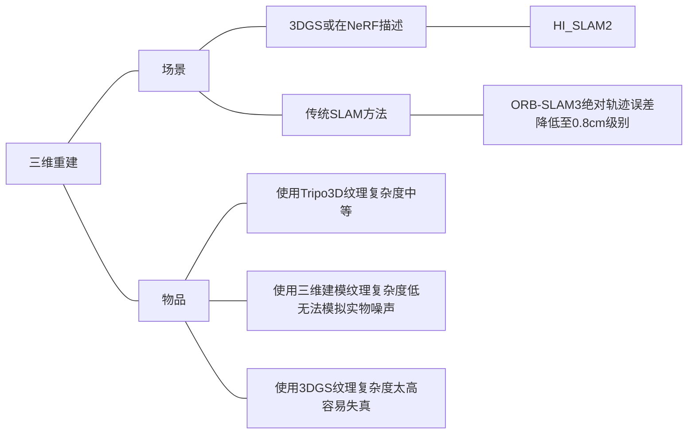

#### 3DGS三维重建mesh
* ![[Pasted image 20250507165746.png]]
#### ORB-SLAM3 构建Mesh面
![[Pasted image 20250507163648.png]]
![[Pasted image 20250507163804.png]]

#### HI-SLAM2
![[Pasted image 20250507165902.png]]
![[Pasted image 20250507165844.png]]

#### nvblox - ESDF（Min-0.02m下的构图效果）
* ![[Pasted image 20250507173607.png]]

