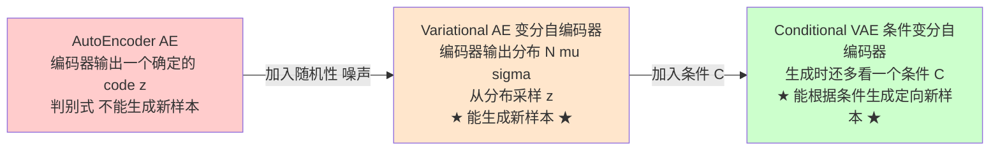

#### AE架构如下
![[Pasted image 20250530114334.png]]
#### VAE猜想
![[Pasted image 20250530120549.png]]
* Target:只需要Decoder的部分，随机生成一个feature，就能得到一张新图片
#### AE缺陷
* 对于一个训练好的AE，输入某个图片，就只会将其编码为某个确定的feature，输入特定的code就只会输出特定的图片，如果这个feature来源自没见过的图片，那么生成的图片质量也不会好
![[Pasted image 20250530120758.png]]
* 假设我们训练好的AE将“新月”图片encode成code=1（这里假设code只有1维），将其decode能得到“新月”的图片；将“满月”encode成code=10，同样将其decode能得到“满月”图片。这时候如果我们给AE一个code=5，我们希望是能得到“半月”的图片，但由于之前训练时并没有将“半月”的图片编码，或者将一张非月亮的图片编码为5，那么我们就不太可能得到“半月”的图片。因此AE多用于数据的压缩和恢复，用于数据生成时效果并不理想。

#### 解决问题
* 把`数值编码feature`更改为`分布`
* 将`新月`从特征编码1变为特征为1区间$\mu=1$  的正态分布 
* 将`满月`从特征编码10变为特征为10区间$\mu=10$的正态分布
* 求最大似然估计，求特征编码为5区间$\mu=5$的正态分布区间
![[Pasted image 20250530124846.png]]
### #VAE架构
![[Pasted image 20250530125141.png]]
* 如上图所示，VAE与AE整体结构类似，不同的地方在于AE的Encoder直接输出code，而VAE的Encoder输出的是若干个正态分布的均值(μ1,μ2...μnμ1,μ2...μn)和标准差(σ1,σ2...σnσ1,σ2...σn)，然后从每个正态分布N(μ1,σ21),N(μ2,σ22)...N(μn,σ2n)N(μ1,σ12),N(μ2,σ22)...N(μn,σn2)采样得到编码code(Z1,Z2...Zn)(Z1,Z2...Zn)，再将code送入Decoder进行解码

VAE的loss函数
* 1. 为了让输出和输入尽可能像，所以要让输出和输入的差距尽可能小，此部分用MSELoss来计算，即最小化MSELoss
* 2. 训练过程当中，如果仅使输入和输出的误差尽可能小，那么随着不断训练，会使得σσ趋近于0，这样就使得VAE越来越像AE，丢失了随机性。对数据产生了过拟合，编码的噪声也会消失，导致无法生成未见过的数据(为了解决这个问题，我们要对μμ和σσ加以约束，使其构成的正态分布尽可能像标准正态分布，具体做法是计算N(μ,σ2)N(μ,σ2)与N(0,1)N(0,1)之间的KL散度，即最小化下式)
$$
\mathrm{KL}(\mathcal{N}(\mu, \sigma^2) \,\|\, \mathcal{N}(0, 1)) = \frac{1}{2} \left( -\log \sigma^2 + \mu^2 + \sigma^2 - 1 \right)
$$

#### KL散度计算（求导技巧）
具体的code是从正态分布采样得到的，此时的这个采样的操作是不可导的，这会导致在反向传播时$Z$对$\mu$和$\sigma$无法直接求导，因此这里用到一个trick：重参数化技巧（reparametrize）。具体思想是：
*  从$\mathcal{N}(0, 1)$ 当中采样一个$\varepsilon$    , 然后 $Z = \mu + \varepsilon \times \sigma$ ，相当于直接从$\mathcal{N}(\mu, \sigma^2)$ 采样$Z$ 
![[Pasted image 20250530133940.png]]

## 6. 附录：AE vs VAE vs CVAE 区别速通

  

### 6.1 三者的进化关系

  

  

### 6.2 AE → VAE：加入随机性

  

**AE 的问题**：编码器直接输出一个确定的 code，相当于把每个样本压成隐空间里的一个**点**。隐空间是离散的、有"空洞"的，所以从两个点之间随便取一个 z 解码，往往输出垃圾。**AE 是判别式模型，不具备生成能力。**

  

**VAE 的改进**：编码器不再输出一个点，而是输出**一组正态分布的参数 $(\mu_i, \sigma_i)$**。从分布中采样 z，相当于把每个样本变成隐空间里的一**团**。这样隐空间被铺满，能在团之间插值，从而具备**生成新样本的能力**。

  

VAE 的损失函数有两项：

1. **重建损失** $\text{MSE}(\hat{x}, x)$：让 Decoder 还原得越接近原图越好。

2. **KL 散度** $D_{KL}(\mathcal{N}(\mu, \sigma) \| \mathcal{N}(0, I))$：**这一项至关重要**！如果只优化重建，模型会学到让 $\sigma \to 0$ 把分布退化成一个点，VAE 就退化成 AE 了。KL 散度强制每个样本的分布都向标准正态靠近，**保证隐空间是连续、规整、可采样的**。

  

$\mathcal{L}_{\text{VAE}} = \text{MSE}(\hat{x}, x) + \lambda \cdot D_{KL}(\mathcal{N}(\mu, \sigma) \| \mathcal{N}(0, I))$

  

### 6.3 VAE → CVAE：加入条件

  

**回到你的问题：CVAE 与 VAE 的区别，确实就是多了一个"条件 condition"！** 但这个"多一个条件"带来了本质性的功能升级。

  

| 维度 | VAE | CVAE |

| :--- | :--- | :--- |

| 训练目标 | $p(x)$ 学习数据本身的分布 | $p(x \| C)$ 学习"给定条件下"的数据分布 |

| Encoder 输入 | 只看 $x$ | 看 $(x, C)$ 联合 |

| Decoder 输入 | 只用 $z$ 生成 | 用 $(z, C)$ 生成 |

| 推理能力 | 随机生成"任意"新样本 | 根据条件生成"定向"新样本 |

| 类比 | "随机抽奖：给我画一张图" | "点菜：给我画一张猫" |

  

CVAE 的 ELBO 公式：

$\log p(x | C) \geq \mathbb{E}_{z \sim q(z|x,C)}[\log p(x | z, C)] - D_{KL}(q(z|x,C) \| p(z|C))$

  

在实际实现里通常简化成 $p(z|C) \approx \mathcal{N}(0, I)$（条件先验直接用标准正态）。

  

### 6.4 对应到 GenDexGrasp 的 PointNetCVAE

  

把上述公式具象化：

| 符号 | 在 GenDexGrasp 里的含义 |

| :--- | :--- |

| $x$ | GT 接触图 $\Omega$（向量维度 2048） |

| $C$ | **物体点云 $O$**（B × 2048 × 3） |

| $z$ | 抓取意图（128 维隐变量） |

| $q(z\|x, C)$ | Encoder：看着 GT 接触图 + 物体，推断 $\mu, \sigma$ |

| $p(x\|z, C)$ | Decoder：根据 z + 物体，预测每点接触概率 |

  

具体的损失函数（来自 `train_cvae_criterion.py`）：

$\mathcal{L} = 100 \cdot \sqrt{\text{MSE}(\hat{\Omega}, \Omega)} + 1 \cdot D_{KL}(\mathcal{N}(\mu, \sigma) \| \mathcal{N}(0, I))$

  

跟你笔记里 VAE 的 loss 是同一个套路，只是：

- 重建损失换成了 sqrt(MSE)（或带 attention 加权的版本）。

- KL 散度形式完全不变。

- **多了一个条件 $O$ 输入到 Encoder 和 Decoder 里**——这就是 "C" of CVAE。

  

### 6.5 为什么必须是 CVAE 而不是 VAE？

  

如果只用普通 VAE（不带物体条件）会发生什么？

- Encoder 把 GT 接触图压成 z，Decoder 从 z 还原接触图。

- 但**接触图的"位置含义"依赖于物体的几何**。同一个 z 对一个杯子的意义和对一把刀的意义完全不同。

- 没有条件 $O$，Decoder 不知道这 2048 个点该贴到什么物体上，**生成的接触图就失去了几何意义**，无法用于后续抓取优化。

  

所以 GenDexGrasp 必须用 **CVAE**：**物体点云作为强制条件，永远跟着 z 一起喂进 Decoder**。

  

---

  

## 7. 一句话总结

  

> **PointNetCVAE = "PointNet 编码全局 + 局部点云特征" + "CVAE 学习抓取意图的隐空间分布" + "条件解码每点接触概率"**

  

它做的事情非常单纯：**给一个物体，告诉我每个表面点该不该被抓**（输出一张接触热力图）。而"具体哪只手怎么抓"则完全交给后面的 Adam 几何优化阶段解决——网络与机械手彻底解耦，这就是 **Hand-Agnostic** 的精髓。