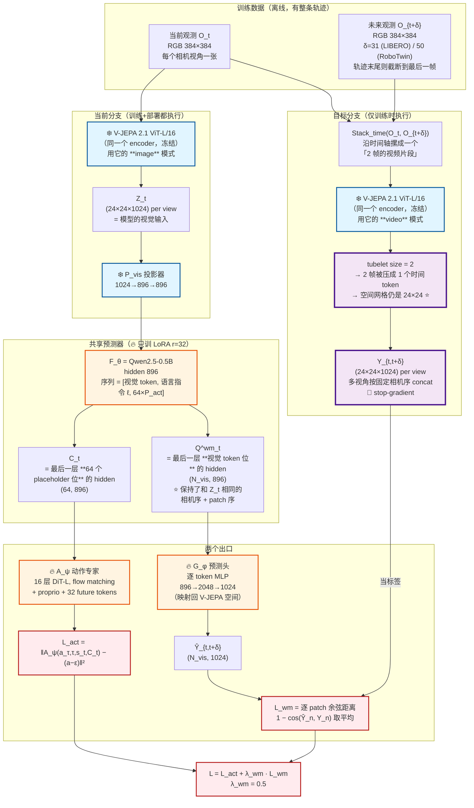
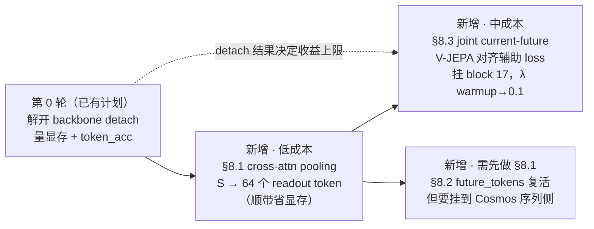

# JEPA-WAM 精读 — latent WAM 四类范式，与 motionWAM 到底属于哪一类

> 论文：*JEPA-WAM: Learning Vision-Language-Action Policies with Joint-Embedding World Modeling*
> arXiv:2608.09381v1 [cs.RO]，2026-08-10。人民大学 + XYZ Embodied AI + 清华 AIR
> 本地 PDF：[[JEPA-WAM- Learning Vision-Language-Action Policies with Joint-Embedding World Modeling.pdf]]
> 阅读日期：2026-08-12。已读完正文 8 页 + 附录 A–E（共 22 页）
> 对照代码：`/Users/felix/Desktop/Project/motionwam/`（DiT4DiT）、`/Users/felix/Desktop/Project/Xiaomi-Robotics-1/`（XR-1）
> 相关笔记：[[未来发展 - pi05 GROOT future 范式下视觉-动作联立建模下的流如何融合?]]、[[生成模型新范式 - JiT or Drifting Model]]、[[模型loss差异]]

---

## 0. TL;DR

1. **motionWAM (DiT4DiT) 属于 Figure 2 的 (a) WAMs 类。** 这不是我做的类比 —— **论文正文点名引用了 DiT4DiT**（`Ma et al. 2026`），把它当作"policy integration 做错了"这一条的代表作。见 [§2](#2-论文自己把-dit4dit-归了类不是我在推测)。

2. 但要加三条修正：motionWAM 只跑 1 步不迭代（比 (a) 便宜）、action 梯度被 `detach` 切断（比 (a) 弱）、曾经有 (b) 的机制但被注释掉了。见 [§3.3](#33-三条必须加的修正)。

3. **论文的两个创新点**：
   - **目标侧**：不预测未来，预测"当前+未来的联合编码"（joint current–future target）。见 [§4](#4-创新点一joint-currentfuture-target--重点章节)。
   - **耦合侧**：一个 predictor 同时干两件事，但用**两组不同位置的 hidden** 分别承担 —— 视觉位算世界模型 loss，专用 placeholder 位喂动作专家。见 [§5](#5-创新点二shared-predictor--dedicated-action-placeholders)。

4. **对 motionWAM 最值钱的三条借鉴**（按性价比排序）：
   - ① 用少量专用 readout token 取代"整个 `vl_embs` 当 cross-attn K/V"（论文里这个消融是全文最差变体，−6.1 点）
   - ② 加一个 joint current–future 的 V-JEPA 对齐辅助 loss（纯加法，挂在 block 17）
   - ③ 迁移配方里那个 attention mask：辅助分支只许通过**梯度**塑形 backbone，不许往动作通路注入未来表征

   见 [§8](#8-对-motionwam-的具体启示)。

5. **不建议**因为"0.5B 打到 79.2"就动摇 Cosmos backbone。regime 完全不同，而且论文自己的证据也指向"辅助目标比这个架构更值钱"。见 [§9](#9-明确不建议照搬的)。

---

## 1. 黑话词典 — 每个术语"在哪里"

> 这一节是给后面正文当字典用的。每条都标明：**它是张量还是模块 / 在哪个位置 / 形状是多少 / 训不训**。
> 如果后面看到不认识的词，回来这里查。

### 1.1 通用术语（不限于这篇论文）

| 术语 | 是什么 | 在哪里 / 形状 |
|---|---|---|
| **patch（图块）** | 把一张图切成小方块。ViT 不是整张图一起看，而是切块后每块变成一个向量 | JEPA-WAM：384×384 的图，每 16×16 像素一块 → **24×24 = 576 块** |
| **token** | 一个 patch 变成的那个向量。也可以是一个文字、一个占位符 | V-JEPA 输出的每个 patch token 是 **1024 维** |
| **hidden states（隐状态）** | Transformer 每一层跑完后，每个 token 位置上的那个向量。**"第 i 层的 hidden" = 第 i 层跑完时的中间产物** | Qwen2.5-0.5B 的 hidden 是 **896 维** |
| **readout（读出）** | 从一堆 hidden 里"取出"某些位置的向量拿去用。取哪些位置是设计选择 | 见 [§5.2](#52-两组-hidden两个出口--这是全文最核心的设计) |
| **head（头）** | 挂在主干后面的一个小网络（通常 1~3 层 MLP），把 hidden 转成你要的东西 | JEPA-WAM 的 `G_φ`：896→2048→1024 |
| **cross-attention（交叉注意力）** | A 序列去"查询" B 序列的信息。B 提供 Key/Value，A 提供 Query。**B 不会被 A 改变** | motionWAM：动作序列（Q）查询 `vl_embs`（K/V） |
| **self-attention（自注意力）** | 一个序列内部互相看 | — |
| **prefix（前缀）** | 序列前面那一段。在 VLM 里通常是"图像 token + 文字 token"，动作 token 排在后面 | π0.5 的 prefix = 图像 + 语言 |
| **placeholder token（占位符 token）** | 一个**没有实际内容**的可学习向量，塞进序列里，目的是让它在跑完 Transformer 后"吸收"周围的信息，然后你去读它 | JEPA-WAM 有 64 个 action placeholder |
| **stop-gradient / detach** | 告诉 PyTorch "梯度不要从这里往回传"。**前向计算照常，反向传播被切断** | `x.detach()` |
| **frozen（冻结）** | 这个模块的参数不更新。和 detach 不同：冻结是"参数不动"，detach 是"梯度不流过" | V-JEPA encoder 全程冻结 |
| **LoRA** | 微调大模型的省钱办法：不改原权重，旁边加两个小矩阵（秩 r），只训小矩阵 | JEPA-WAM：r=32, α=64, dropout 0.1 |
| **cosine distance（余弦距离）** | `1 − cos(a, b)`。只看两个向量**方向**像不像，不看长度。表征对齐常用它而不是 MSE，因为表征的"长度"通常没有意义 | 见 [§4.4](#44-损失函数为什么是余弦距离而不是-mse) |
| **flow matching（流匹配）** | 生成模型的一种。在"噪声 → 数据"的直线路径上，让网络预测速度。详见 [[FM vs DP noise denoise流程分析]] | 两边的动作专家都用它 |

### 1.2 这篇论文特有的东西

| 符号 | 中文 | 是什么 / 在哪里 | 形状 | 训不训 |
|---|---|---|---|---|
| `E_J` | V-JEPA encoder | **冻结的** V-JEPA 2.1 ViT-L/16，图像编码器。就是一个"把图变成 patch 向量"的函数 | 输入 384×384 → 输出 24×24×1024 | ❄️ 全程冻结 |
| `Z_t` | 当前视觉表征 | `E_J` 吃**当前观测**的输出，多相机各自编码后按固定相机序拼起来。**这是模型的输入** | `(N_vis, 1024)`，N_vis = 视角数 × 576 | — |
| `Y_{t,t+δ}` | **joint current–future target（联合当前-未来目标）** | `E_J` 吃**当前+未来两帧**的输出。**这是标签，不是输入！** 详见 [§4](#4-创新点一joint-currentfuture-target--重点章节) | 和 `Z_t` 同形状 | ❄️ stop-gradient |
| `δ` | 时间偏移 | 未来帧比当前帧晚多少帧。benchmark 特定的超参 | LIBERO: **31**；RoboTwin: **50** | 超参 |
| `P_vis` | 视觉投影器 | 2 层 MLP，把 V-JEPA 的 1024 维翻译成 Qwen 能吃的 896 维 | 1024→896→896, GELU | ❄️ policy 训练时冻结 |
| `F_θ` | **shared predictor（共享预测器）** | **Qwen2.5-0.5B**。名字叫 predictor 但它就是个 LLM 主干。"shared" 指它同时服务世界模型和动作两个任务 | hidden 896 | 🔥 只训 LoRA |
| `P_act` | action placeholder | 64 个可学习的占位符 token，追加在 Qwen 序列末尾 | 64 个 | 🔥 |
| `Q^wm_t` | 世界模型侧 hidden | Qwen **最后一层**、**视觉 token 那些位置**的 hidden。用来预测 `Y` | `(N_vis, 896)` | — |
| `C_t` | 动作条件表征 | Qwen **最后一层**、**64 个 placeholder 位置**的 hidden。**唯一喂给动作专家的东西** | `(64, 896)` | — |
| `G_φ` | transition prediction head | 逐 token 的 MLP，把 `Q^wm_t` 从 896 维映射回 V-JEPA 的 1024 维空间，好和 `Y` 比较 | 896→2048→1024, GELU | 🔥 |
| `A_ψ` | action expert（动作专家） | 16 层 DiT-L，flow matching。吃 `C_t` + proprio + 32 个 future token | — | 🔥 |
| `λ_wm` | 世界模型 loss 权重 | `L = L_act + λ_wm · L_wm` | 主模型 **0.5**；π0.5 迁移 **0.1** | 超参 |
| `proprio` | 本体感知状态 | 机器人自己的关节角/夹爪开度等。就是 motionWAM 里的 `state` | LIBERO 7 维动作 | — |

### 1.3 motionWAM 侧对应的东西（方便对照）

| 术语 | 在 motionWAM 哪里 | 形状 |
|---|---|---|
| `vl_embs` / `last_hidden` | Cosmos transformer **block 17** 的 forward hook 抓到的 hidden，flatten 后 | `(B, S, 2048)`，**S = T·H'·W'** 时空展平 |
| `extract_layer: 17` | `dit4dit_sonic_pnp.yaml:14` — 从第几层抓 | — |
| `future_video_loss` | Cosmos 在 latent 空间对未来视频做 rectified flow 的 MSE | 标量，权重 0.1 |
| `future_tokens` | `ActionDiT.py:261-262` — **已被注释掉的死代码** | 原本 32 个 |
| action head | `DiscreteFlowMatchingActionHead`，16 层 Cross-Attn DiT-B | — |

> 详见 `motionwam/docs/architecture.md`（如果链接失效，路径是 `/Users/felix/Desktop/Project/motionwam/docs/architecture.md`）

---

## 2. 论文自己把 DiT4DiT 归了类（不是我在推测）

这是本篇最需要先说清楚的事实。JEPA-WAM 正文第 2 页，Introduction 第二段：

> Regarding **policy integration**, existing approaches either use predicted future representations as **additional context for the action module (Ma et al. 2026)** or introduce a separate prediction objective or latent dynamics module alongside the policy (Sun et al. 2026). **The former may expose the action module to redundant future-state information**, whereas the latter may only weakly influence the representations from which actions are generated.

而参考文献第 9 页：

> Ma, T.; Zheng, J.; Wang, Z.; Jiang, C.; Cui, A.; Liang, J.; and Yang, S. 2026. **Dit4dit: Jointly modeling video dynamics and actions for generalizable robot control.**

`Ma et al. 2026` = DiT4DiT = motionWAM。

**所以 JEPA-WAM 是拿 motionWAM 当靶子写的 related work**，而且批评点非常具体：

> "may expose the action module to **redundant future-state information**"
> （可能让动作模块暴露在冗余的未来状态信息里）

这句批评在 motionWAM 上的具体所指，见 [§8.1](#81-最高优先级vl_embs-的条件方式对应消融-f)。

---

## 3. Figure 2 的四类范式，与 motionWAM 的归类

![[JEPA-WAM-figure2-latent-wam-paradigms.png]]

### 3.1 四个子图怎么读

图里的**颜色**是关键线索：

- **青绿色（teal）** = 世界模型自己的 latent 空间里的东西
- **米色/灰色（beige）** = VLM/语言模型 token 空间里的东西
- **蓝色** = V-JEPA 空间
- **虚线方框** = 迭代（去噪步骤）

| 子图 | 机制拆解 | 代表工作 |
|---|---|---|
| **(a) WAMs** | WM Backbone 在**自己的 latent 空间**里吃观测 token（下方青绿）、吐未来 token（上方青绿）。Action Expert 直接挂在这个 backbone 上。**没有 Align 箭头** —— 因为它是真的在生成未来，不是在对齐表征 | **DiT4DiT / motionWAM**、WorldVLA、Cosmos-Policy |
| **(b) Dedicated Latent-Dynamics VLAs** | VLM Backbone 自己多吐**一个**压缩的未来 latent token（左上角单个青绿方块），和一个 target 做 **Align**。注意是**一个** token，不是一整张 patch 网格 | FLARE、Frappe、Being-H0.7 |
| **(c) VLAs with Dedicated Latent Dynamics** | VLM Backbone → **独立的 LAM 模块**（Latent Action/Dynamics Model）→ 单个 latent → Action Expert。LAM 是**串在中间**的额外模块 | LaWAM (Chen et al. 2026) |
| **(d) Ours** | V-JEPA Encoder → LLM as Predictor。上方**一整排**方块做 Align（不是一个），且 predictor 只有一个，同时服务两个任务 | JEPA-WAM |

> ⚠️ **论文的一个排版缺陷**：(b) 和 (c) 的标题几乎一模一样 —— "Dedicated Latent-**Dynamics** VLAs" vs "VLAs with **Dedicated Latent Dynamics**"。区分只能靠图里有没有那个 `LAM` 方框。(b) 是 backbone 自己多吐一个 token，(c) 是外挂一个独立模块。

### 3.2 motionWAM = (a)：拓扑上完全对应

| (a) 图里的元素 | motionWAM 里对应什么 |
|---|---|
| WM Backbone | `CosmosTransformer3D`（Cosmos-Predict2.5-2B 的视频扩散 DiT） |
| 下方青绿 token（输入） | 条件帧经 VAE 编码的 latent + 未来时间步的 noisy latent slot |
| 上方青绿 token（输出） | 预测的未来 latent 速度场 → `future_video_loss` |
| 青绿色 = 世界模型自己的空间 | **VAE latent 空间**（不是 VLM token 空间）✅ 完全对应 |
| WM Backbone → Action Expert 箭头 | block-17 hidden (`vl_embs`) 经 cross-attention 喂 DiT-B head |
| 没有 Align 箭头 | ✅ motionWAM 确实没有表征对齐，它是真的在做生成 |
| Action Expert 内部虚线 | ✅ DFM 的 MaskGIT 16 步迭代 |

颜色这条尤其能确认：motionWAM 的条件特征来自 **VAE latent 空间**，不是 (b)/(c) 那种 VLM token 空间。这就是 (a) 的定义特征。

### 3.3 三条必须加的修正

拓扑对应≠完全一样。以下三条我回代码核对过：

#### 修正 1 — (a) 图里的"迭代"对 motionWAM 不成立

```yaml
# dit4dit_sonic_pnp.yaml:12
future_num_inference_steps: 1
```

hook 挂在 **denoise step 0**，推理时 backbone 只跑这一次 forward。

**所以论文摘要那句批评只中一半**：

> "video generation based WAMs incur substantial deployment cost due to **iterative** future prediction"

motionWAM 贵在 **10.5B pipeline 单步的绝对开销**，不在迭代次数。它其实坐在 "(a) 视频生成 WAM" 和 "latent WAM" 之间 —— 结构是 (a)，部署成本模式更像 latent WAM。

#### 修正 2 — motionWAM 是 (a) 的一个**被削弱**的版本

(a) 图里 `WM Backbone → Action Expert` 那两根箭头，在 motionWAM 里**只有前向，没有反向**。代码核对：

```
Cosmos25.py:169,171     hook 抓 hidden 时无条件 .detach()
Cosmos25.py:889-890     if detach: hidden = hidden.detach()
Cosmos25.py:1117,1130   _Cosmos25_Interface.forward 两个分支都硬编码 detach=True
```

（这和 `motionwam/docs/xr1_vs_motionwam_borrowables.md` §4.0 的结论一致，我重新核对确认成立。）

梯度通路现状：

| 路径 | 状态 |
|---|---|
| `future_video_loss` → Cosmos backbone | ✅ 通 |
| `action_loss` → action head | ✅ 通 |
| **`action_loss` → Cosmos backbone** | ❌ **断** |

**这一点对着 JEPA-WAM 的核心主张读特别刺眼。** 它整篇的论点就是：

> transition supervision **directly shapes the backbone** from which action representations are extracted
> （时序监督必须直接塑形那个"动作表征所从中抽取"的主干）

motionWAM 有前半句 —— `future_video_loss` 确实在塑形 backbone。但后半句断了：**action head 读到的是一个梯度上冻结的特征快照**，backbone 对动作任务零适配压力。

#### 修正 3 — motionWAM 曾经有 (b) 的机制，但主动注释掉了

```python
# ActionDiT.py:261-262
# self.future_tokens = nn.Embedding(config.num_target_vision_tokens, self.input_embedding_dim)
# nn.init.normal_(self.future_tokens.weight, mean=0.0, std=0.02)

# ActionDiT.py:342-344
# future_tokens = self.future_tokens.weight.unsqueeze(0).expand(vl_embs.shape[0], -1, -1)
# sa_embs = torch.cat((state_features, future_tokens, action_features), dim=1) \
```

而 config 里 `num_target_vision_tokens: 32` 还留着（`dit4dit_sonic_pnp.yaml:46`），现在是**死 schema**。

也就是说 motionWAM 是从 "(a)+(b) 混合" **退回**到纯 (a) 的。这个细节在 [§8.2](#82-future_tokens-是现成的插槽而且已经是死代码) 会派上用场。

### 3.4 归类小结

> **motionWAM 是 Figure 2(a)，而且是被 JEPA-WAM 点名批评的 (a) 代表作。同时它是 (a) 的一个削弱版 —— 图里那两根 backbone→expert 箭头只有前向没有反向。**

---

## 4. 创新点一：joint current–future target ← 重点章节

> 这一节回答你的问题："joint-current latent 到底是哪里输出的东西，要怎么作为输入，意义在哪里"。
> **先说最重要的一句：它不是输入，它是标签。** 下面详细拆。

### 4.1 先纠正一个最容易搞错的地方：它是"标签"，不是"输入"

这是整篇论文最容易误读的点，所以放最前面。

```
❌ 错误理解：joint current-future latent 是一个特征，喂给模型当输入
✅ 正确理解：joint current-future latent 是一个"答案"，模型要去猜它
```

用监督学习的语言说：

| 角色 | 是什么 | 谁产生 |
|---|---|---|
| **输入 x** | `Z_t` = 当前观测的 V-JEPA 表征 + 语言指令 | `E_J(O_t)` |
| **标签 y** | `Y_{t,t+δ}` = **joint current–future target** | `E_J(Stack(O_t, O_{t+δ}))`，**stop-gradient** |
| **预测 ŷ** | `Ŷ_{t,t+δ} = G_φ(Q^wm_t)` | 模型算出来的 |
| **loss** | `1 − cos(ŷ, y)` 逐 patch 平均 | — |

`Y` 上面有 `sg`（stop-gradient）标记，意思是：**它只当答案用，梯度不会从它往回流**。它是一个固定的、不可训练的监督信号，跟"图像分类的 one-hot 标签"是同一个角色 —— 只不过这个标签不是人标的，而是另一个冻结网络算出来的（这叫 self-supervised / distillation）。

**推论：部署时它根本不存在。** 因为 `O_{t+δ}` 是"未来的那一帧图"，真机跑的时候你还没走到那个时刻，当然拿不到。论文 §A.5 明说：

> At deployment, the target branch and prediction head are removed.

部署时只剩：当前帧 V-JEPA encoder → visual projector → shared predictor → action expert。

### 4.2 它是"哪里输出的东西"—— 完整数据流

回答"哪里来的"：**来自一个全程冻结的 V-JEPA 2.1 encoder，输入是训练集里的两帧图。**



公式化（论文 Eq. 1、2）：

$$Z_t = \text{Concat}_{v\in V}\ E_J(O^v_t)\ \in \mathbb{R}^{N_{vis}\times d_J}$$

$$Y_{t,t+\delta} = \text{Concat}_{v\in V}\ \text{sg}\Big(E_J\big(\text{Stack}_{\text{time}}(O^v_t,\ O^v_{t+\delta})\big)\Big)\ \in \mathbb{R}^{N_{vis}\times d_J}$$

注意两式**形状完全一样**（都是 `N_vis × d_J`）。这不是巧合，是下一小节那个工程巧合带来的。

### 4.3 ⭐ 关键工程巧合：为什么两帧编码出来还是 24×24

这是整个设计能"免费"成立的原因，值得单独讲。

**tubelet 是什么**：ViT 处理图像时把图切成 16×16 的 patch。处理**视频**时还要切时间维 —— 把连续几帧摞成一个"时空小方块"，这个方块叫 tubelet（管块）。**V-JEPA 2.1 的 tubelet 时间尺寸是 2**，也就是每 2 帧压成 1 个时间 token。

于是：

```
输入 1 帧（image 模式）  → 24×24 空间网格 × 1 个时间位 = 576 个 token
输入 2 帧（video 模式）  → 24×24 空间网格 × 1 个时间位 = 576 个 token   ← 一样！
                          ↑ 因为 2 帧刚好被 tubelet(size=2) 吃成 1 个时间位
```

**这带来两个免费的好处**：

1. **`Y` 和 `Z` 天然逐 patch 对齐**。第 n 个 token 在两边都对应"第 v 个相机、第 (i,j) 个 patch"。所以 loss 可以直接逐 token 算余弦距离，**不需要任何插值、投影、或空间对齐操作**。
2. **`Q^wm_t` 也自动对齐**。因为 Qwen 是逐位置处理 token 的（不改变序列长度和顺序），视觉 token 位的 hidden 依然保持"相机序 + patch 序"。论文原话：

   > Because `Q^wm_t` preserves the fixed camera and spatial ordering of `Z_t`, `Ŷ_{t,t+δ}` maintains **patch-level correspondence** with the joint current–future target.

论文把这叫 **spatially structured**（空间结构化）—— 意思就是"token 还保持着它们原本的 patch 排列，没有被池化成一个向量、也没被压缩成几个 token"。这是它和 (b) 类方法（压成 1 个 latent token）的核心区别。

> 💡 **对比 π0.5 迁移配方**：那边没有这个巧合。64 个 future token 只能排成 **8×8** 的粗网格，得靠**双线性上采样**放大到 24×24 才能和 target 对齐。见 [§6](#6-迁移配方把这套东西加到已有的-vla-上)。

### 4.4 损失函数：为什么是余弦距离而不是 MSE

$$L_{wm} = \frac{1}{B\,N_{vis}}\sum_{b=1}^{B}\sum_{n=1}^{N_{vis}} \Big(1 - \cos\big(\hat{Y}^{(b)}_{t,t+\delta,n},\ Y^{(b)}_{t,t+\delta,n}\big)\Big)$$

逐句读：

- `Σ_n` 遍历**每一个 patch**（所有视角所有位置）→ 这就是 "patch-level supervision"
- `1 − cos(·,·)` 只管方向对不对，不管长度 → 表征学习的惯例。因为一个表征向量的"模长"通常没有语义（乘个 2 还是同一个意思），逼网络匹配模长是浪费容量
- `Y` 有 stop-gradient → 只有 `F_θ`（的 LoRA）和 `G_φ` 被更新

对比 motionWAM 的 `future_video_loss`：那个是 **MSE on 速度场**（`MSE(v_pred, z − x0)`），在 VAE latent 空间。两者的差别不只是 MSE vs cosine：

| | motionWAM `future_video_loss` | JEPA-WAM `L_wm` |
|---|---|---|
| 目标空间 | VAE latent（**可解码回像素**） | V-JEPA 表征（**语义空间，解不回像素**） |
| 预测什么 | 未来 latent 的**速度场** | 当前-未来的**联合表征** |
| 度量 | MSE | 逐 patch 余弦距离 |
| 隐含要求 | 要能重建出**一个具体的**未来 | 只要捕捉当前↔未来的**关系** |

最后一行是关键。见下一小节。

### 4.5 意义在哪里 —— 为什么"联合编码"比"预测未来"好

这是全文最有价值的论证，论文用 **3 个探针实验** 来支撑，而不是只丢一个消融数字。

#### 4.5.1 直觉：未来是多模态的，"关系"才是可复用的

假设机器人面前有个杯子，指令是"拿起杯子"。

- **预测未来（future-only）**：模型要猜"1 秒后的画面长什么样"。但手可能从左边伸过去，也可能从右边；可能快一点，也可能慢一点。**未来不唯一**。逼模型重建一个具体的未来，等于在逼它把多个可行解平均掉（这和 `motionwam/docs/xr1_vs_motionwam_borrowables.md` §4.2 讲 min-of-N 时说的"多模态平均化"是同一个病）。
- **联合编码（joint）**：模型要猜的是"这两个时刻**之间发生了什么关系**" —— 哪些区域没变（桌子、背景）、哪些变了（手、杯子）、物体之间的相对位置怎么演化。**这个关系比具体的未来画面更稳定，也更跨任务通用**。

论文的表述（§4 结论段）：

> Rather than requiring reconstruction of a complete or unique future observation, it emphasizes their **visual relation**: which regions remain stable or change, and how local object and spatial relations differ across time.

#### 4.5.2 证据一：策略层面的三向消融（Table 6）

三种目标构造，其他全部相同，跑 LIBERO-Plus：

| 目标构造 | 数学形式 | LIBERO-Plus Avg |
|---|---|---|
| Endpoint difference（端点相减） | `E_J(O_{t+δ}) − E_J(O_t)`，两帧**分别**编码后相减 | **70.9** |
| Future only（只要未来） | `E_J(O_{t+δ})` | 77.3 |
| **Joint current–future（联合）** | `E_J(Stack(O_t, O_{t+δ}))`，两帧**一起**编码 | **79.2** |

注意 endpoint difference 最差（70.9），**比 future-only 还差 6.4 点**。这个结果很反直觉 —— 端点相减看起来"更直接地表达了变化"，而且它**明明看过了两个端点**。

所以问题变成：**为什么"一起编码"比"分别编码再相减"好这么多？** 这就需要探针实验。

#### 4.5.3 证据二：控制时间间隔的解码探针（Table 7）← 你要的那张表

实验设计非常巧妙，值得细看：

**设计**：固定一个未来锚点 `O_f`，只改变"当前帧"，构造 6 组配对：

$$(O_f, O_f),\ (O_{f-10}, O_f),\ (O_{f-20}, O_f),\ (O_{f-30}, O_f),\ (O_{f-40}, O_f),\ (O_{f-50}, O_f)$$

对应时间间隔 `g ∈ {0, 10, 20, 30, 40, 50}`。**未来帧在 6 组里完全相同**，只有当前帧和"两帧的关系"在变。

然后**冻结**表征，训一个 6 分类的线性探针（ridge probe），让它猜时间间隔。RoboTwin Clean-20，1000 episodes，20 任务，外部相机，每 episode 取 2 个锚点 → 12000 对。episode-disjoint 划分（30 训 / 10 验 / 10 测），1000 次 bootstrap 估不确定性。

| 表征 | 准确率（chance = 16.7%） | 95% CI |
|---|---|---|
| Future only | **16.7**（构造上必然，sanity check） | 16.7–16.7 |
| Current only | 44.6 | 42.5–47.0 |
| Endpoint difference | 47.0 | 45.0–49.1 |
| **Joint target** | **67.2** | 65.3–69.1 |

**逐行怎么读**（这四行每一行都有独立作用，不是随便列的）：

1. **Future only = 16.7%**：等于随机瞎猜。这是**故意的健全性检查** —— 因为未来帧被固定住了，只看未来的表征在 6 类里一模一样，**信息量为零是必然的**。这一行的作用是证明实验设计没漏（如果它高于 16.7%，说明有信息泄漏，整个实验作废）。
2. **Current only = 44.6%**：只看当前帧就能猜到 44.6%。为什么？因为它能利用**轨迹相位** —— "手已经伸出去一半了"这类线索本身暗示了离终点还有多远。这一行的作用是给出一个"不需要任何时序建模就能达到的基线"。
3. **Endpoint difference = 47.0%**：这是**真正的对手**。它看过了两个端点的全部信息，只是通过"相减"来表达关系。结果只比"只看当前帧"高 2.4 点。
4. **Joint target = 67.2%**：比 endpoint difference 高 **+20.1 点**（paired improvement，95% bootstrap CI `[18.3, 21.9]`）。

**为什么 +20.1 这个数字有说服力**：因为 endpoint difference **已经拿到了两个端点的全部信息**（它就是 `E(O_f) − E(O_{f-g})`），未来帧还被控制住了。所以这 20 点的差距**不可能来自信息量差异** —— 只能来自"信息的可读性"。

> **结论**：把两帧**送进同一次编码**，让 encoder 内部的注意力去建立跨帧关联，产出的表征里"时间关系"是**线性可读**的。而"分别编码再相减"这个操作，把关系压成了一阶差分，丢掉了非线性的部分。
>
> 通俗说：`E(A) − E(B)` 只能表达"A 和 B 差多少"；`E(A 和 B 一起)` 能表达"A 到 B 之间发生了什么"。

论文还画了混淆矩阵（Figure 6）：joint target 有明显的对角线结构，endpoint difference 只有部分时序排序能力。

#### 4.5.4 证据三：泛化到没见过的时间间隔（Table 8）

上一个实验只证明"能区分 6 个离散类"。会不会只是记住了 6 个类别的特征，而不是学到连续的时序信号？

**设计**：探针**只在 `g ∈ {0, 20, 40}` 上训练**，测 `g ∈ {10, 30, 50}`。其中 10 和 30 是**内插**，50 是**外插**（超出训练时见过的最大间隔）。

| 测试间隔 | Endpoint difference | Joint target |
|---|---|---|
| 10 | **8.09** | 10.22 |
| 30 | 10.93 | **4.39** |
| 50（外插） | 20.95 | **12.03** |
| **Overall** | 13.32 | **8.88** |

（数值 = 平均绝对误差 MAE，单位帧，越低越好）

整体 13.32 → 8.88，改善 4.44 帧（95% CI `[3.87, 5.00]`）。只看内插的 {10, 30}：9.51 → 7.31。

**注意论文自己的诚实表述**：joint target **不是每个间隔都更好**（g=10 时反而输了）。但整体误差更低说明"时序信号不局限于区分固定的几类，而是泛化到没见过的时间间隔"。

#### 4.5.5 证据四：减掉直线位移后的残差轨迹（Table 9）—— 我认为最漂亮的一个

前面两个探针证明了"有结构化的时间关系"。但这个关系会不会**只是**两端点之间的位移？

**设计**：设 `δ=50`，机器人状态轨迹 `s_t, ..., s_{t+50}`（14 维双臂）。定义直线插值

$$\bar{s}_{t+k} = \Big(1 - \frac{k}{50}\Big)s_t + \frac{k}{50}s_{t+50},\quad k = 1,\dots,49$$

和残差

$$r_k = s_{t+k} - \bar{s}_{t+k}$$

探针**只拿两个端点的冻结视觉表征**，预测完整的 `49 × 14` 残差轨迹。因为 `s_t → s_{t+50}` 的直线位移**已经被减掉了**，探针必须从"两帧的视觉关系"里推断出"这段运动是怎么弯的"。而且 encoder **从没看过中间任何一帧的机器人状态**。

| 目标 | Endpoint diff. | Joint target | 差值 |
|---|---|---|---|
| 12 维手臂残差 | 0.488 | **0.581** | +0.093 |
| 14 维状态残差 | 0.485 | **0.582** | +0.097 |

（mean R²，越高越好；paired 改善 95% CI `[0.082, 0.112]`；**49 个中间时刻全部更好**，逐步改善 0.069–0.116）

**意义**：joint 表征里的额外信息不只是"起点和终点在哪"，还包含**区间内的轨迹结构** —— 这段运动是直着走还是绕了个弧，从两帧的视觉关系里就能读出来。

#### 4.5.6 反向控制实验（Table 10）—— 论文自己打自己一下

直接预测端点位移 `Δs = s_{t+50} − s_t`：

| 表征 | Mean R² | 95% CI |
|---|---|---|
| **Endpoint difference** | **0.740** | 0.711–0.777 |
| Joint target | 0.718 | 0.680–0.761 |

**这次 endpoint difference 赢了**（paired effect −0.022，CI `[−0.036, −0.009]`）。

论文把这个反向结果**主动写出来**并解释：

> This reverse result clarifies the distinction between the two representations rather than suggesting that the joint target is uniformly superior. Feature differencing provides a strong representation of **first-order endpoint change**, whereas joint encoding better preserves **temporal relations and within-interval trajectory structure**.

**这种自我设限的实验诚实度，我认为比结论本身更值得学。** 它把"joint 好在哪、不好在哪"划得很清楚：joint 牺牲了一阶端点差的精度，换来了区间内轨迹结构。而机器人策略需要的恰好是后者（你要生成整段 action chunk，不是只到终点）。

#### 4.5.7 补充：空间诊断（Table 11）

还有一个定性诊断。为了排除"两帧 vs 单帧编码模式差异"这个混淆变量，用了**匹配的静态对照**：

$$Y_{joint} = E_J(\text{Stack}(O_t, O_{t+50})),\qquad Y_{static} = E_J(\text{Stack}(O_t, O_t))$$

注意 `Y_static` 也是两帧输入（同一帧重复两次），所以两者的编码模式完全一样，差异只来自"第二帧是不是真的未来"。定义逐 patch 变化量 `r_p = 1 − cos(Y_joint,p, Y_static,p)`，和降采样到同一网格的 RGB 变化量比较：

| 空间对照 | 中位 Pearson 相关 |
|---|---|
| **Joint vs 匹配静态当前** | **0.279** |
| Joint vs 匹配静态未来 | 0.182 |
| Joint vs 匹配静态端点均值 | 0.190 |

正相关说明表征变化确实**空间上关联到画面变化的区域**。但相关性只有中等（0.279），论文自己解释：目标表征的是高层视觉结构，可能捕捉物体构型、遮挡、接触、上下文关系等超出局部 RGB 位移的东西。所以他们把这个定位成"支持空间结构化的时序信息"，**而不是"精确的运动定位"**。

---

## 5. 创新点二：shared predictor + dedicated action placeholders

### 5.1 要解决的问题

回到 [§2](#2-论文自己把-dit4dit-归了类不是我在推测) 那句批评。世界模型监督和动作生成怎么耦合，有两种失败模式：

| 失败模式 | 症状 | 论文点名的代表 |
|---|---|---|
| **耦合太紧** | 把预测的未来表征直接当动作条件 → 动作模块被"冗余的未来状态信息"淹没，两个目标在同一批 hidden 上互相干扰 | `Ma et al. 2026` = **DiT4DiT/motionWAM** |
| **耦合太松** | 世界模型是个独立分支/独立模块 → 只能"弱影响"那些真正生成动作的表征 | `Sun et al. 2026` = VLA-JEPA |

JEPA-WAM 的解法是走中间：**共享主干（够紧），但读出口分开（够松）**。

### 5.2 两组 hidden、两个出口 ← 这是全文最核心的设计

一次 forward，公式（论文 Eq. 3）：

$$(Q^{wm}_t,\ C_t) = F_\theta\big(P_{vis}(Z_t),\ \ell,\ P_{act}\big)$$

Qwen2.5-0.5B 的输入序列长这样：

```
序列位置：  [ 投影后的视觉 token ...... | 语言指令 ℓ ...... | 64 个 action placeholder ]
              ↑ N_vis 个                   ↑ 若干个            ↑ 64 个可学习占位符
              │                                                │
              └─ 最后一层这些位置的 hidden = Q^wm_t              └─ 最后一层这些位置的 hidden = C_t
                 → 走 G_φ → 算 L_wm（世界模型）                     → 喂 A_ψ 动作专家 → 算 L_act
```

**两个出口的分工**（论文原话）：

> `Q^wm_t` **preserves** the fixed camera and spatial-token ordering of `Z_t`, whereas `C_t` **aggregates** the preceding visual and task context. `Q^wm_t` learns visual temporal structure rather than a complete instruction-conditioned future.

翻译一下：

| | `Q^wm_t`（视觉位） | `C_t`（placeholder 位） |
|---|---|---|
| 位置 | 视觉 token 那些位置 | 末尾 64 个占位符位置 |
| 形状 | `(N_vis, 896)`，保持 patch 网格 | `(64, 896)`，无空间结构 |
| 性质 | **保序**（preserve），逐 patch 对应 | **聚合**（aggregate），把前文压缩 |
| 学什么 | 视觉时序结构（跟语言基本无关） | 视觉上下文 + 任务指令的融合 |
| 去哪 | `G_φ` → `L_wm` | 动作专家 `A_ψ` |
| **动作专家能看到它吗** | ❌ **看不到** | ✅ 这是唯一入口 |

**为什么这样分能同时避开两个失败模式**：

- **够紧**：两个 loss 都更新**同一个** `F_θ`（的 LoRA）。所以 `L_wm` 学到的时序知识，会通过共享权重改变 `C_t` 的内容 → 直接塑形动作生成所依赖的表征。这就是论文反复强调的 "**directly shapes the backbone**"。
- **够松**：动作专家只吃 `C_t`（64 个聚合向量），**不吃** `Q^wm_t`（几百个带着完整未来预测信息的 patch token）。所以不会被"冗余的未来状态信息"淹没。

> 💡 一句话记法：**知识通过梯度传，不通过前向传。**

### 5.3 消融证据：这个设计值 6.1 点（Table 4）

LIBERO-Plus 上的受控消融，全部变体用同一套 policy 训练配置：

| 变体 | 改了什么 | Avg | Δ vs JEPA-WAM |
|---|---|---|---|
| **JEPA-WAM** | — | **79.2** | — |
| **(f) Full hidden** | **去掉 action placeholder，动作专家吃全部 last hidden** | **73.1** | **−6.1** ⬅ 最差 |
| (a) DINO+SigLIP | 换视觉 encoder，且无 transition 预测 | 73.2 | −6.0 |
| (d) iREPA align. | 逐 token 对齐 → 3×3 卷积变换 + 空间归一化 | 74.7 | −4.5 |
| (e) Lower-16 align. | transition loss 挂第 16 层而非最后一层 | 76.5 | −2.7 |
| (b) V-JEPA only | 保留 V-JEPA 但**关掉** transition 预测 | 77.0 | −2.2 |
| (c) Future only | 目标换成 `E_J(O_{t+δ})` | 77.3 | −1.9 |

**这张表最重要的读法**（很容易看漏）：

> **(f) 是所有变体里最差的（73.1），比"完全不做 transition 预测"的 (b) 还差 3.9 点。**

也就是说：**"把 transition 表征直接当动作条件"的伤害（−6.1），比"根本不做 transition 预测"（−2.2）大将近三倍。**

这就是 §2 那句 "may expose the action module to redundant future-state information" 的量化证据。**做错了比不做更糟。**

其余几行的独立信息：

- **(b) 77.0 vs (a) 73.2**：光是把视觉 encoder 从 DINOv2+SigLIP 换成 V-JEPA、**不加任何 transition 预测**，就 +3.8 点。所以 **V-JEPA 的视频预训练本身贡献了一半以上的 OOD 收益**，transition objective 再加 2.2。论文很老实地把这个 disentangle 出来了 —— 这意味着**"换个好 encoder"和"加世界模型监督"是两件独立的事**，别把功劳全记在后者头上。
- **(d) −4.5**：iREPA 那个 3×3 卷积会"局部混合邻域特征"，削弱空间对应、丢细粒度细节。说明 [§4.3](#43--关键工程巧合为什么两帧编码出来还是-2424) 那个逐 patch 对齐是真的重要，不是可有可无的洁癖。
- **(e) −2.7**：transition loss 要挂在**最终读出层**，不要挂中间层。论文：直接监督 final shared predictor 比"用中间层当辅助信号"更有效。**这一条对 motionWAM 有直接指导意义**，见 [§8.3](#83-目标函数加一个-joint-currentfuture-对齐辅助-loss)。

### 5.4 动作专家侧（Eq. 6）

标准 conditional flow matching，和 π0 / GROOT 那套一样：

$$a_\tau = (1-\tau)\epsilon + \tau a,\qquad L_{act} = \mathbb{E}_{\epsilon,\tau}\Big[\big\|A_\psi(a_\tau, \tau, s_t, C_t) - (a - \epsilon)\big\|^2_2\Big]$$

细节：

- `τ` 用 **Beta(α=1.5, β=1.0)** 采样 —— 和 XR-1 完全一样（见 `motionwam/docs/xr1_vs_motionwam_borrowables.md` §5.3）
- 主要用 **velocity prediction**（预测 `a − ε`）
- **RoboTwin 2.0 例外：改用 x-prediction**（直接预测干净轨迹）。理由是 50 步双臂的长 chunk 上更稳定，并引 JiT (Li & He 2025) 作为动机 —— 这个正好接上 [[生成模型新范式 - JiT or Drifting Model]] 那篇笔记的论点
- 动作专家额外吃 **32 个 learnable future tokens**（注意这和 §6 里 π0.5 迁移用的 64 个 future tokens **不是一回事**，别搞混：这 32 个是 StarVLA action head 设计的一部分，纯粹是动作专家内部的容量）
- 推理 **4 步 Euler**

### 5.5 训练与部署

$$L = L_{act} + \lambda_{wm}L_{wm},\qquad \lambda_{wm} = 0.5$$

两个 loss 都更新 `F_θ`。

**部署（§A.5）**：target 分支和 prediction head 全部移除。剩下：当前帧 V-JEPA encoder → visual projector → shared predictor → action expert。**不需要未来帧、不需要 joint target 编码、不需要迭代生成未来。**

---

## 6. 迁移配方：把这套东西加到已有的 VLA 上

> 我认为这是**对 motionWAM 最有用的部分** —— 因为它明确设计成"不改动原有感知/动作通路"。

### 6.1 六步配方（§3.4 + §A.4）

在预训练好的 π0.5 上加 transition 监督，灵感来自 VaLR (Jeon et al. 2026)：

| 步 | 做什么 | 具体参数 |
|---|---|---|
| 1 | VLM prefix 后追加 **64 个 learnable future tokens**，取其 output hidden `R_t` | `R_t ∈ ℝ^{64×2048}` |
| 2 | reshape 成**粗空间网格** | `8×8×2048` |
| 3 | LayerNorm + MLP | `2048→2048→1408`，GELU（**1408 = V-JEPA 2.1 ViT-G 的维度**，注意这里用的是 ViT-G 不是主模型的 ViT-L） |
| 4 | **双线性上采样** 8×8 → 24×24，与冻结的 V-JEPA joint target 逐 patch 余弦对齐 | — |
| 5 | `λ_wm` 在前 **1K step 线性 warmup 到 0.1** | 主模型是 0.5，迁移场景刻意压低 5 倍 |
| 6 | ⭐ **attention mask**：future tokens **可以**看原始 image+language prefix；**action tokens 被禁止** attend 到 future tokens | — |

公式（Eq. 8、9）：

$$\tilde{R}_t = \text{Reshape}(R_t) \in \mathbb{R}^{H_f\times W_f\times d_f},\qquad \hat{Y}_{t,t+\delta} = \text{Upsample}\big(P_{sp}(\tilde{R}_t)\big) \in \mathbb{R}^{N_{vis}\times d_J}$$

### 6.2 ⭐ 第 6 步是整个配方的精髓

再强调一次，因为这条最容易被忽略：

> The future tokens can attend to the original image and language prefix, while **the action tokens are prevented from attending to these newly introduced queries**. Thus, the auxiliary branch shapes the shared VLA backbone through transition supervision **without introducing additional future-token conditioning into the original action pathway**.

**这恰好是 (f) 消融告诉他们不能做的事。** 辅助分支只通过**梯度**塑形共享 backbone，绝对不把预测的未来表征注入动作通路。

推理时：future tokens **留在** VLM prefix 里（因为拿掉会改变 attention 模式），但 action token 依然被 mask 掉看不见它们。所以：

> no predicted future representation is explicitly provided to the action expert, and action generation follows the **original π0.5 pathway**.

### 6.3 迁移配方的收益比主架构更大

**这是我读这篇论文最重要的一个观察。** 看 Δ 而不是绝对值 —— 因为绝对值受 3B backbone + robot pretrain 影响，只有 Δ 是可迁移的证据：

| Benchmark | π0.5 | π0.5 + JEPA Obj. | Δ |
|---|---|---|---|
| LIBERO（ID） | 96.9 | 97.8 | +0.9 |
| LIBERO-Plus（OOD） | 84.5 | **86.3** | +1.8 |
| RoboTwin Clean | 75.4 | 84.6 | **+9.2** |
| RoboTwin Random | 37.2 | 37.5 | +0.3 |
| 真机 ID | 77.5 | **90.3** | **+12.8** |
| 真机 OOD | 72.5 | **84.7** | **+12.2** |

**推理开销：54.05ms → 55.12ms（+2%），基本免费。**

而且 `π0.5+JEPA Obj.` 是 LIBERO-Plus 全表最高分（86.3），LIBERO ID 也是最高（97.8）。

> ⚠️ 注意 RoboTwin Random 只 +0.3。Clean +9.2 但 Random +0.3，这个反差论文没解释。可能的读法：transition 监督在**训练分布内的任务执行质量**上帮助大，但对**强域随机化**（RoboTwin Random 会改场景和物体配置）帮助有限。这跟真机 OOD +12.2 有点矛盾，值得留个疑问。

---

## 7. 其他实现细节速查

都在附录里，抄的时候需要：

### 7.1 架构（§A.1）

| 项 | 值 |
|---|---|
| V-JEPA encoder | **ViT-L/16**，输入 384×384，每视角 24×24 grid × 1024 维 |
| 多视角处理 | **各自独立编码 → 按固定相机序 concat → 不做任何空间池化** |
| 视觉 projector | 1024→896→896，GELU，2 层 |
| shared predictor | Qwen2.5-0.5B，hidden 896 |
| prediction head `G_φ` | 逐 token MLP，896→2048→1024，GELU |
| action placeholder | **64 个** |
| action expert | **16 层 DiT-L**，flow matching，额外吃 proprio + **32 个 learnable future tokens** |
| 推理采样 | **4 步 Euler** |

### 7.2 数据配置（§A.1、§B）

| Benchmark | 相机 | action horizon H | 时间偏移 δ | 动作维度 |
|---|---|---|---|---|
| LIBERO / LIBERO-Plus | 1 primary + 1 wrist | **8** | **31** | 7 |
| RoboTwin 2.0 | 1 external + 2 wrist | **50** | **50** | 14（双臂） |
| 真机 AgileX CobotMagic | 1 global + 2 wrist | — | — | 双 6-DoF + 夹爪 |

轨迹末尾：future observation **截断到最后一可用帧**。

### 7.3 训练（§A.2、§A.3）

**阶段一 — VL 对齐**（robot 训练之前）：
- 按 Prismatic (Karamcheti et al. 2024) **单阶段** 配方，**没有独立的 projector-alignment 阶段**
- V-JEPA 冻结；visual projector + **完整 Qwen2.5-0.5B** 一起微调
- 数据 LLaVA v1.5，只对 assistant response 做自回归 LM
- 2 epoch，AdamW lr 2e-5，wd 0.1，cosine decay，3% warmup，BF16，global batch 128

**阶段二 — robot policy 训练**：
- ❄️ 冻结：V-JEPA encoder、visual projector、**Qwen base 权重**
- 🔥 只训：**Qwen LoRA（r=32, α=64, dropout 0.1）** + prediction head `G_φ` + action expert `A_ψ`
- AdamW peak lr **2e-4** → cosine decay 到 1e-5，3% warmup，**zero weight decay**，grad clip 1.0
- BF16 + **FSDP**，8 GPU，global batch 128，**60K steps**

> 对比 motionWAM：Accelerate + DeepSpeed ZeRO-2，分组 lr（backbone 1e-5 / head 1e-4）。JEPA-WAM 用 LoRA 所以能用统一的高 lr。

### 7.4 推理效率（§C.3，RoboTwin 设定）

| 方法 | 中位延迟 | 频率 |
|---|---|---|
| π0.5 | 54.05 ms | 18.50 Hz |
| π0.5 + JEPA Obj. | 55.12 ms | 18.14 Hz |
| **JEPA-WAM** | **85.00 ms** | **11.76 Hz** |
| ABot-M0 | 125.23 ms | 7.99 Hz |

### 7.5 主要结果

**LIBERO-Plus（OOD，无 OOD 微调）**：

| 方法 | Backbone 参数 | 机器人预训练 | Avg |
|---|---|---|---|
| VLA-Adapter | 0.5B | ✗ | 60.4 |
| RoVLA | 2B | ✗ | 76.0 |
| ResVLA | 2B | ✗ | 77.1 |
| **JEPA-WAM** | **0.5B** | ✗ | **79.2** ← 无预训练最佳 |
| VLA-JEPA | 2B | ✓ | 79.5 |
| Cosmos-Policy | 2B | ✓ | 83.0 |
| π0.5 | 3B | ✓ | 84.5 |
| Being-H0.7 | 3B | ✓ | 84.8 |
| **π0.5 + JEPA Obj.** | 3B | ✓ | **86.3** ← 全场最佳 |

**LIBERO（ID）**：JEPA-WAM 96.7（Spa 95.6 / Obj 99.4 / Goal 97.2 / Long 94.6）；π0.5+JEPA Obj. 97.8。

**RoboTwin 2.0（20 任务，只在 Clean 上训）**：

| 方法 | Clean | Random |
|---|---|---|
| DP | 48.0 | 1.6 |
| ACT | 51.8 | 4.0 |
| DP3 | 73.9 | 8.3 |
| **JEPA-WAM** | **79.9** | **36.9** |
| π0.5（有预训练） | 75.4 | 37.2 |
| π0.5 + JEPA Obj. | **84.6** | **37.5** |

> JEPA-WAM 无预训练、0.5B backbone，Random 上 36.9 ≈ 有预训练 3B 的 π0.5 的 37.2。这是全文最有说服力的单个数字。

**真机（5 个双臂任务，各 10 rollout，归一化完成分数）**：

| 方法 | ID | OOD |
|---|---|---|
| π0 | 51.8 | 22.5 |
| **JEPA-WAM** | 59.8 | **54.2** |
| π0.5 | 77.5 | 72.5 |
| **π0.5 + JEPA Obj.** | **90.3** | **84.7** |

> 注意 π0 的 ID→OOD 掉了 29.3 点，JEPA-WAM 只掉 5.6 点。抗 OOD 能力的差距比绝对值更有意思。

### 7.6 论文自陈的 Limitation（§6）

> JEPA-WAM is designed to learn **general visual temporal structure** rather than reconstruct a task-specific future. ... it captures shared patterns ... that are **largely independent of language**. While such supervision can be broadly reused across tasks, **it may be less expressive when the same observation leads to substantially different transitions under different instructions.**

翻译：joint target 基本**和语言无关** —— 它学的是"任务共享的视觉时序结构"。所以当同一个画面在不同指令下应该导向完全不同的 transition 时（比如桌上有杯子和盘子，"拿杯子" vs "拿盘子"），这个监督信号表达力不足。作者把"语言条件化 / 多模态 transition 目标"列为 future work。

**这个 limitation 对 motionWAM 反而是个相对优势**：`future_video_loss` 走的是 Cosmos 的 prompt cross-attention，是**语言条件化**的未来预测。所以两者的监督信号不完全重叠 —— 这也是 [§8.3](#83-目标函数加一个-joint-currentfuture-对齐辅助-loss) 建议"纯加法、不动 `future_video_loss`"的一个理由。

---

## 8. 对 motionWAM 的具体启示

### 8.1 最高优先级：`vl_embs` 的条件方式（对应消融 (f)）

**现状**：motionWAM 把**整个** block-17 hidden 直接当 cross-attn 的 K/V：

```python
# ActionDiT.py:350
model_output = self.model(
    hidden_states=sa_embs,
    encoder_hidden_states=vl_embs,      # ← (B, S, 2048) 完整时空 token 网格
    ...
)
```

`S = T·H'·W'`，是完整的时空 token 网格，**其中包含未来 latent slot 的中间表征**。这在字面上就是 JEPA-WAM 那句 "the action expert does not need to rely on the full predicted transition representation" 的反面。

> ⚠️ **诚实的 caveat，必须写清楚**：(f) 在 JEPA-WAM 里的伤害机制是"同一批 hidden 同时承担两个 objective → 目标互相干扰"。motionWAM 的情况**不同** —— `future_video_loss` 是通过 block 17 **之后**的层算的，而且 action 梯度本来就 detach 了，所以**干扰机制并不相同，不能把 −6.1 直接搬过来**。
>
> 但"给 action head 喂了大量冗余未来状态信息"这条批评本身是站得住的，值得实验验证。

**低成本验证方案**：在 `vl_embs` 和 head 之间插一个 learned cross-attn pooling（perceiver-resampler 式），把 S 个 token 压到 64 个再喂 head。

这个改动的好处：

1. **不动 backbone、不破坏 checkpoint 兼容性**（只在 head 输入侧加一个模块）
2. **顺带大幅降低 head 每层 cross-attn 的开销** —— S 很大，这正是 `motionwam/docs/xr1_vs_motionwam_borrowables.md` §4.3 想省的显存的另一条路，而且比那条更彻底
3. **能直接回答**"full hidden vs dedicated readout"在 motionWAM 上成不成立

比该文档 §4.1 那个"多层 cross-attn 中间态"便宜得多。**建议插到第 1 轮或第 3 轮。**

### 8.2 `future_tokens` 是现成的插槽，而且已经是死代码

见 [§3.3 修正 3](#修正-3--motionwam-曾经有-b-的机制但主动注释掉了)。`ActionDiT.py:261-262, 342-344` 注释掉的 `future_tokens`，加上 config 里还留着的 `num_target_vision_tokens: 32`，**就是 JEPA-WAM §3.4 迁移配方需要的那个插槽**。

> ⚠️ **但有一个位置差异，别踩坑**：
>
> | | 挂在哪 | 效果 |
> |---|---|---|
> | motionWAM 原本的 `future_tokens` | **action head 的输入序列**里（GROOT 那套） | 只能塑形 head |
> | JEPA-WAM 的 future tokens | **VLM/backbone 的 prefix** 上 | 塑形 backbone ✅ |
>
> 要按 JEPA-WAM 的思路做，token 得挂到 **Cosmos 序列侧**，或者接受"只塑形 head 不塑形 backbone"的削弱版。**后者意义不大** —— 因为整篇论文的论点就是要塑形 backbone。

### 8.3 目标函数：加一个 joint current–future 对齐辅助 loss

这条我觉得最值得认真掂量。

**motionWAM 的 `future_video_loss` 在 JEPA-WAM 的分类里，恰好是论证最弱的那一类目标** —— 它是 **future-only 的、重建型**目标（预测唯一未来 latent 的速度场）。而 Table 6 说 joint (79.2) > future-only (77.3)，Appendix C.2 的论证是：**要求重建一个唯一的未来是浪费的**（未来本身多模态），"当前↔未来的关系"才是可跨任务复用的信号。

**具体可做的实验（纯加法，不碰 `future_video_loss`）**：

在 block-17 hidden（或新开一个 readout）上挂一个轻量 head，对齐冻结 V-JEPA 2.1 的 joint `(O_t, O_{t+δ})` 目标，逐 patch 余弦距离，λ 从 0 warmup 到 0.1。

理由：

1. **它是目前唯一能把"非重建型时序信号"喂进 backbone 的低成本手段**。这和 `motionwam/docs/xr1_vs_motionwam_borrowables.md` §4.2 里"辅助头必须挂在 detach 之前"那条论证同源，但**目标函数比 min-of-N 更有据** —— min-of-N 只是缓解多模态平均化，这个是直接注入时序结构。
2. **空间维度上可行，而且比 JEPA-WAM 还宽裕**。Cosmos hidden 是 `(B, C, T, H', W')`，本来就有空间网格结构，reshape + 上采样到 V-JEPA 的 24×24 是直接的 —— 比 π0.5 迁移配方从 **8×8** 上采样还宽裕得多（那边只有 64 个 token 排 8×8）。
3. **消融 (e) 给了挂点的明确指导**：对齐要挂在**读出层**，不要挂中间层。motionWAM 的 action 特征取自 **block 17**，那对齐就该挂 block 17，而不是 transformer 最后一层。
4. **两个 loss 挂点不同反而是好事**：`future_video_loss` 挂在 transformer 末端（要算速度场），新 loss 挂 block 17。位置不同 → 不直接冲突，而且正好覆盖了"block 17 hidden 对动作任务零适配压力"这个空洞。
5. **和论文的 limitation 互补**：JEPA-WAM 自陈 joint target 与语言无关；motionWAM 的 `future_video_loss` 是语言条件化的。**两个监督信号不重叠，理论上可以叠加。**

> ⚠️ **耦合警告**：这条和 `motionwam/docs/xr1_vs_motionwam_borrowables.md` §4.0 的 detach 实验是**耦合**的。如果 detach 不解开，这个新 loss 依然能塑形 backbone（走 `future_video_loss` 那条 grad-enabled 通路），但 **action head 读到的还是冻结快照** → 收益会打折。
>
> **所以顺序上还是 detach 实验先行。**

### 8.4 三条借鉴的落地顺序建议

挂到 `motionwam/docs/xr1_vs_motionwam_borrowables.md` §8 那个路线图上：



- **§8.1 最先做**：不破坏 checkpoint 兼容、顺带省显存、能独立回答一个明确问题
- **§8.3 依赖 §4.0 的 detach 结论**：detach 不解开则收益打折
- **§8.2 依赖 §8.1**：得先有 readout 机制才好谈往哪挂 future token

---

## 9. 明确**不**建议照搬的

### 9.1 不要因为"0.5B 打到 79.2"就动摇 Cosmos backbone

这个诱惑很大 —— 0.5B predictor + 300M 冻结 encoder，85ms / 11.76Hz，对比 motionWAM 的 10.5B pipeline。但 **regime 完全不同**：

1. **benchmark 偏向性**：LIBERO-Plus 测的是**仿真视觉鲁棒性**（camera / robot / language / light / background / noise / layout 七类扰动）。V-JEPA 的大规模视频预训练在这个轴上天然占优 —— **消融 (b) 已经说了，光换 encoder 不加任何 transition 预测就 +3.8 点**。这部分收益跟"世界模型范式"无关。
2. **控制 regime 不同**：motionWAM 押的是 50Hz 全身控制 + FSQ motion token（见 `motionwam/docs/architecture.md` §13.4）；JEPA-WAM 真机是 6-DoF 双臂 AgileX，action horizon 8~50，控制频率低得多（11.76Hz）。
3. **⭐ 论文自己的证据也指向"辅助目标比架构值钱"**：真机上 `π0.5+JEPA Obj.` (90.3/84.7) **远好过** JEPA-WAM 本体 (59.8/54.2)。RoboTwin Clean 上 84.6 vs 79.9 也是。

> **该借的是 objective 和 readout 设计，不是 backbone。**

这和 `motionwam/docs/xr1_vs_motionwam_borrowables.md` §7 第 1 条"不要放弃 `future_video_loss`"的判断一致。

### 9.2 不要直接把 −6.1 当作 motionWAM 的预期收益

见 [§8.1](#81-最高优先级vl_embs-的条件方式对应消融-f) 的 caveat。干扰机制不同，−6.1 是 JEPA-WAM 架构下的数字。要自己量。

### 9.3 不要照搬 λ_wm = 0.5

JEPA-WAM 主模型 0.5，但那是**从头训 policy** 的场景。迁移到已有的 π0.5 时他们自己降到 **0.1，且前 1K step 线性 warmup**。motionWAM 已经有一个 `0.1 × future_video_loss`，再加一个辅助 loss 应该从 **0.1 或更低起步 + warmup**，避免和现有的两个 loss 打架。

### 9.4 不要期待它解决 chunk 边界连续性

JEPA-WAM 完全没碰异步 / prefix / chunk 边界这个问题（它 4 步 Euler、H=8，压根没这个痛点）。`motionwam/docs/xr1_vs_motionwam_borrowables.md` §3 那套 prefix inpainting 三件套仍然是 P0，**这两条线互不替代**。

---

## 10. 三份工作的横向对照

| 维度 | **motionWAM (DiT4DiT)** | **XR-1** | **JEPA-WAM** |
|---|---|---|---|
| Figure 2 归类 | **(a) WAMs** | 不属于任何一类（无世界模型） | (d) Ours |
| Backbone | Cosmos-Predict2.5-2B 视频扩散 DiT | Qwen3-VL-4B-Instruct（全量微调） | ❄️V-JEPA 2.1 ViT-L + 🔥Qwen2.5-0.5B(LoRA) |
| Backbone 是生成模型吗 | ✅ 是 | ❌ 否 | ❌ 否（但 V-JEPA 是预测式表征） |
| 世界模型监督 | `future_video_loss`（latent 空间 rectified flow MSE） | **无** | `L_wm`（V-JEPA 空间逐 patch 余弦） |
| 监督目标性质 | **future-only，重建型**，语言条件化 | — | **joint current+future，关系型**，语言无关 |
| 条件特征取法 | block-17 forward hook @ denoise step 0 | **逐层 KV cache 共享**（36↔36） | 最后一层 **64 个 placeholder** 位 hidden |
| 喂给动作专家的东西 | **完整** `(B,S,2048)` 时空网格 | VLM 全部 K/V 前置到自注意力 | **只有 `C_t` = (64, 896)** |
| 世界模型梯度到 backbone | ✅ 通 | — | ✅ 通 |
| **动作梯度到 backbone** | ❌ **断（硬编码 detach）** | ✅ 通（全量逐层） | ✅ 通（LoRA） |
| 动作建模 | DFM（离散，FSQ token CE）+ gripper MSE | 连续 rectified flow | 连续 flow matching（RoboTwin 用 x-pred） |
| 采样 | MaskGIT 16 步 | Euler 5 步 | Euler **4 步** |
| 时间分布 | `Beta(1.5,1.0)/0.999`（logit_normal for video） | `1 − Beta(1.5,1.0)` | **Beta(1.5, 1.0)** |
| 异步 / prefix 训练 | ❌ 无 | ✅ 三件套 | ❌ 无（H=8 无此痛点） |
| 泛化押注 | **架构**（video dynamics 联合建模） | **数据**（100K+ 小时 UMI + VLM 自动标注） | **表征 + 目标函数**（V-JEPA 空间 + 关系型目标） |
| 训练框架 | Accelerate + DeepSpeed ZeRO-2，分组 lr | Lightning + DeepSpeed，单一 lr 2e-5 | FSDP，LoRA r=32，lr 2e-4 |

**三条不同的赌注**（这个框架我觉得挺有用）：

- **motionWAM**：赌"让 backbone 同时学会预测未来视频"能带来动力学先验 → 押**架构**
- **XR-1**：赌"100K 小时 embodiment-free 数据 + 自动标注"能带来泛化 → 押**数据**
- **JEPA-WAM**：赌"好的预训练表征空间 + 关系型监督目标"能带来 OOD 鲁棒性 → 押**表征与目标函数**

三者**不互斥**。JEPA-WAM 的 §3.4 迁移配方明确说了它可以加在别人的 policy 上而不改动原通路 —— 所以理论上 motionWAM 可以同时持有三个赌注。

---

## 11. 一句话总结

> **motionWAM 就是 Figure 2(a)，而且是被 JEPA-WAM 点名批评的 (a) 代表作（`Ma et al. 2026`）；它同时还是 (a) 的一个削弱版 —— action 梯度被 detach 掉，(a) 图里那两根 backbone→expert 箭头只有前向没有反向。**
>
> **JEPA-WAM 提供的三个可借鉴点，按性价比排序：① 用少量 dedicated readout token 取代"全 hidden 当 cross-attn K/V"（消融 (f) 是全文最差变体，且 motionWAM 有现成死插槽）；② 加一个 joint current–future 的 V-JEPA 对齐辅助 loss（纯加法，挂在 block 17 而非末层）；③ 迁移配方里"action token 禁止 attend future token"那个 mask —— 辅助分支只许通过梯度塑形 backbone，不许往动作通路注入未来表征。**
>
> **一句话记法：知识通过梯度传，不通过前向传。**

---

## 附：待确认 / 存疑

1. **RoboTwin Clean +9.2 但 Random 只 +0.3**（§6.3）—— 论文没解释这个反差。而真机 OOD 是 +12.2，跟 Random 的 +0.3 有点矛盾。RoboTwin Random 的"域随机化"和真机 OOD 的"换背景/换物体初始位"可能不是同一类 shift。
2. **δ 的选择依据**：LIBERO 用 31，RoboTwin 用 50，论文只说 "benchmark-specific"，没有 δ 的消融。对 motionWAM 来说 δ 该取多少（50Hz 下 δ=50 只有 1 秒）需要自己扫。
3. **π0.5 迁移用的是 ViT-G target（1408 维），主模型用 ViT-L（1024 维）** —— 为什么不统一？论文没说。可能是想给更大的 backbone 配更强的 teacher。
4. **JEPA-WAM 在 LIBERO-Plus 的 Language 类只有 68.2**，是全表几乎最低（RoVLA 92.9，ResVLA 88.5）。这和 §6 自陈的 "largely independent of language" limitation 高度一致 —— **语言无关的监督换来了视觉鲁棒性，代价是语言理解**。对 motionWAM 是个警告：加这个 loss 可能会削弱语言跟随能力，需要监控。
5. **项目主页说在 GitHub 但正文没给链接** —— 代码是否真开源待查。
