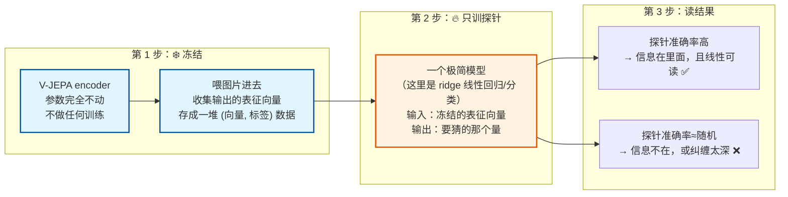
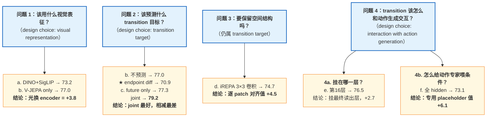

# JEPA-WAM 补充 — 消融实验完整清单 与「探针 probe」到底是什么

> 这是 [[JEPA-WAM 精读 - latent WAM 四类范式与 motionWAM 的归类]] 的**基础知识补充篇**。
> 主笔记讲"论文做了什么、对 motionWAM 有什么用"；这一篇讲"这些实验方法本身是什么意思"。
> 原文：arXiv:2608.09381v1，§4.3（正文消融）+ Appendix C（附录分析）
> 核对日期：2026-08-12，逐表比对了 PDF 原文，所有数字和小计都重算过一遍

---

## 0. 先纠正一个误解（重要）

> ❓ 你的问题：**"探针指的是未来预测帧需要时长序列多大的意思吗？"**
>
> ❌ **不是。** 探针和"需要多长序列"完全无关。

误解从哪来我猜得到 —— 表 8 里出现了 `gap 10 / 30 / 50` 这样的帧数，看起来很像"序列长度设定"。但它们是**探针要猜的答案**，不是模型的输入配置。

一句话摆正：

```
探针（probe）= 一个「检测工具」
用途：检查一个已经冻结的表征里，到底藏着什么信息
它不训练模型、不改变模型、部署时不存在、和推理速度无关
```

论文里有**两个**都以"帧数"为单位的量，长得很像，但角色完全不同 —— 这是全部混淆的源头，见 [§2](#2--最容易混的两个量δ-vs-g)。

---

## 1. 什么是「探针」—— 从零开始

### 1.1 术语溯源

- 英文：**linear probing** / **probing classifier**，中文一般译"线性探针"、"探测"
- 出处：表征学习（representation learning）的标准评测手段，不是这篇论文发明的
- 直觉来源：像医生用探针**插进去看看里面有什么**，但**不动手术** —— 被探测的对象保持原样

### 1.2 它要回答的问题

一个网络（这里是冻结的 V-JEPA encoder）吃了一张图，吐出一堆数字（表征向量）。问题是：

> **这堆数字里到底编码了什么信息？**

你不能直接"看"这些数字 —— 1024 维的向量人眼读不出意义。所以用一个间接办法：

> **如果我能用一个极其简单的模型，从这堆数字里读出某个信息 X，那就说明 X 确实被编码在里面，而且编码得很"直白"。**
> **如果连简单模型都读不出来，说明 X 要么不在里面，要么被埋得太深（纠缠在一起）。**

### 1.3 三步流程



**关键点：被探测的网络全程冻结。** 训练的只有那个巴掌大的探针。所以探针的结果反映的是**表征的性质**，不是"训练得好不好"。

### 1.4 为什么必须用「线性」探针，不能用大 MLP

这点很反直觉，但很重要：

> **探针越弱，结论越强。**

如果你用一个 10 层 MLP 当探针，它可能自己就把答案算出来了 —— 那你根本不知道信息是"原本就在表征里"还是"探针自己推出来的"。

所以探针必须**弱到没有推理能力**，只能做线性组合。这样一旦它成功了，功劳只能归给表征。

> 这也是为什么这类结论常表述为 "**linearly accessible**（线性可读）" 而不是 "present（存在）" —— 探针测的是**可读性**，不只是存在性。这个区别在 [§3.2](#32-探针一控制时间间隔的解码table-7) 那 +20.1 点的解释里是核心。

### 1.5 论文用的具体探针：ridge

**ridge regression / ridge classifier（岭回归）** = 线性回归 + L2 正则。

- **线性**：`y = Wx + b`，就这一个矩阵乘法，没有非线性激活
- **ridge（岭）**：在 loss 里加 `λ‖W‖²`，防止 W 变得很大而过拟合。λ 越大越"保守"
- 论文：`Probe regularization is selected only on the validation set` —— λ 只在验证集上选，不碰测试集。这是防止"调参调到测试集上"的标准做法

在这篇论文里 ridge 有两种用法：

| 表 | 探针类型 | 猜什么 | 指标 |
|---|---|---|---|
| Table 7 | 6 分类**分类器** | 时间间隔属于 6 类中的哪一类 | 准确率 % |
| Table 8 | **回归器** | 时间间隔是多少帧（连续值） | MAE（帧） |
| Table 9 / 10 | **回归器** | 机器人状态轨迹 | R² |

### 1.6 探针能证明什么、不能证明什么

| ✅ 能说明 | ❌ 不能说明 |
|---|---|
| 表征里有 / 没有某种信息 | 策略性能会不会变好（那要靠消融实验） |
| 信息是不是**线性可读**的 | 因果关系（表征有这个信息 ≠ 动作靠它做决策） |
| 两种表征在同一信息上谁更强 | 探针失败一定是信息不存在（也可能只是非线性纠缠） |

**所以论文是"消融 + 探针"两条腿走路**：
- **消融**回答"这个设计有没有用"（→ 成功率）
- **探针**回答"为什么有用"（→ 表征里多了什么）

这两类实验的分工，见 [§5](#5-消融-vs-探针一张表说清分工)。

### 1.7 相关的其他统计术语

一次性列清，后面就不重复解释了：

| 术语 | 含义 | 在这篇论文里 |
|---|---|---|
| **chance accuracy（随机基准）** | 瞎猜的准确率。6 个等概率类别 → `1/6 = 16.7%` | Table 7 的基准线 |
| **MAE**（mean absolute error） | 平均绝对误差 `mean(|预测−真值|)`。单位同真值，**越低越好** | Table 8，单位是"帧" |
| **R²**（决定系数） | 回归的解释力。1 = 完美，0 = 等于直接猜平均值，可以为负。**越高越好** | Table 9 / 10 |
| **Pearson 相关** | 两组数线性相关程度，−1~1 | Table 11 |
| **bootstrap（自助重采样）** | 从测试集里**有放回**地反复抽样重算指标，得到指标的波动范围。用来给出置信区间，而不是只报一个孤零零的数 | 1,000 次 **paired episode-level** 重采样 |
| **95% CI（置信区间）** | 上面那个范围。**两个方法的 CI 不重叠 → 差异比较可信** | 如 `[18.3, 21.9]` |
| **paired（配对）** | 同一批样本上算 A 和 B 的差值，再对差值做统计。比"各自算完再相减"更灵敏，因为消掉了样本本身的难易波动 | 论文所有 CI 都是 paired |
| **episode-disjoint（按 episode 划分）** | 训练/验证/测试用**完全不同的轨迹**，不允许同一条轨迹的帧被切开分到两边 | 每任务 30 / 10 / 10 条 |
| **pooled representation（池化表征）** | 把 24×24 个 patch 向量压成**一个**向量（平均或类似操作） | ⚠️ 探针用的是池化后的，见 [§6.1](#61--探针用的是池化表征不是-patch-网格) |
| **sanity check（健全性检查）** | 故意设计一个"必须失败"或"必须成功"的对照，用来验证实验本身没漏 | Table 7 第一行 |
| **confusion matrix（混淆矩阵）** | 行=真实类别，列=预测类别的矩阵。对角线亮 = 分类准 | Figure 6 |

---

## 2. ⭐ 最容易混的两个量：δ vs g

**这一节直接对着你的疑问。** 论文里有两个都以"帧"为单位的间隔，符号不同、角色完全不同：

| | **δ**（delta） | **g**（gap） |
|---|---|---|
| 中文 | 时间偏移 | 时间间隔 |
| 属于谁 | **模型的超参数** | **探针实验的标签** |
| 在哪出现 | 训练 JEPA-WAM 时，决定"未来帧取哪一帧" | 只在 Appendix C 的探针分析里 |
| 取值 | LIBERO **31**；RoboTwin **50** | `{0, 10, 20, 30, 40, 50}` |
| 谁定的 | 作者定的超参 | 作者构造的 6 个类别 |
| 作用 | 决定 `Y_{t,t+δ}` 这个**标签**怎么算 | 是探针要**猜出来**的那个数 |
| 影响模型吗 | ✅ 影响（换 δ 要重训） | ❌ 完全不影响（探针跑完就丢） |
| 影响推理速度吗 | ❌ 不影响（部署时未来分支已移除） | ❌ 不影响 |

**所以"探针 = 需要多长序列"错在哪：**

1. 探针**不涉及序列长度**。它的输入是 encoder 吐出的**一个（池化后的）向量**，不是一段序列。
2. `g` 是**要猜的答案**，不是"要喂多少帧"。
3. JEPA-WAM 无论训练还是部署，**永远只吃 2 帧**（当前 + 未来，且未来只在训练时有）。它没有"可变长序列"这个设计维度。
4. 真正决定"看多远的未来"的是 **δ**，而 δ 是训练超参，跟探针没关系。

**顺带补一个论文的缺口**：δ 只说了 "benchmark-specific"（LIBERO 31 / RoboTwin 50），**没有 δ 的消融**。所以"未来该看多远"这个问题论文并没有回答。对 motionWAM 来说这是要自己扫的 —— 50Hz 下 δ=50 才 1 秒，可能太短。（已记在主笔记的存疑第 2 条）

---

## 3. 论文的表征分析实验：3 个探针 + 1 对照 + 1 诊断

论文原文措辞很谨慎，**只把三个叫 probe**：

> We consider **three complementary probes**: controlled temporal-gap decoding, generalization to unseen temporal gaps, and recovery of trajectory structure after removing endpoint displacement.

另外两个它自己叫 `Endpoint-displacement **control**`（对照）和 `Spatial **Diagnostic**`（诊断）。分清这个层级有用 —— 对照和诊断的证明力弱于探针。

### 3.0 共用的实验设定（Appendix C.2）

所有探针共享这套设定，看表前先记住：

| 项 | 值 |
|---|---|
| 数据 | RoboTwin Clean-20，**1,000 episodes**，20 任务 |
| 相机 | **只用外部相机**（不用腕部相机） |
| 划分 | 每任务 **30 训 / 10 验 / 10 测**，episode-disjoint（1000/20 = 50 条/任务 ✓ 对得上） |
| 表征 | **全部冻结**，且都过同一个 ridge 探针 |
| 正则化选择 | 只在验证集上选 |
| 不确定性 | 1,000 次 paired episode-level bootstrap |

被对比的两种表征（Eq. 14、15）：

$$z_{joint} = \text{Pool}\big(E_J(\text{Stack}_{time}(O_t, O_f))\big)$$

$$z_{diff} = \text{Pool}\big(E_J(O_f)\big) - \text{Pool}\big(E_J(O_t)\big)$$

注意两个都套了 `Pool`。这一点有个 caveat，见 [§6.1](#61--探针用的是池化表征不是-patch-网格)。

### 3.1 为什么 endpoint difference 才是「真正的对手」

在看具体表之前，先说清这个 —— 不然读不出这些实验的用意。

三种被比较的表征，信息量是不一样的：

| 表征 | 看过哪些帧 | 怎么表达"关系" |
|---|---|---|
| Future only | 只有 `O_f` | 不表达 |
| Current only | 只有 `O_t` | 不表达 |
| **Endpoint difference** | **两帧都看过** | 通过**减法** |
| **Joint target** | **两帧都看过** | 通过 encoder 内部的**注意力** |

所以只有后两个是公平对比 —— **信息量相同，只有"表达方式"不同**。

> 论文原话：`endpoint differencing provides the stronger comparison because it has access to both endpoints but represents their relation through explicit subtraction.`

**这个设计是整套探针实验的关键。** 因为它把"信息量差异"这个混淆变量消掉了 —— 后面任何差距都只能归因于**可读性**，不能归因于"它多看了东西"。

### 3.2 探针一：控制时间间隔的解码（Table 7）

**要问的问题**：joint 表征里是不是真有"两帧之间的时间关系"，而不只是两个端点的内容？

**怎么构造（Eq. 16）**：固定一个未来锚点 `O_f`，只换当前帧：

$$(O_f, O_f),\ (O_{f-10}, O_f),\ (O_{f-20}, O_f),\ (O_{f-30}, O_f),\ (O_{f-40}, O_f),\ (O_{f-50}, O_f)$$

→ `g ∈ {0, 10, 20, 30, 40, 50}`，6 类。每 episode 取 2 个锚点 → `1000 × 2 × 6 = 12,000` 对 ✓

**⭐ 设计精髓：未来帧在 6 类里完全相同。** 所以"未来长什么样"这个信息对分类**毫无帮助** —— 探针想答对，只能靠"这两帧隔多远"这个关系信息。

**探针**：6 分类线性分类器。

| 表征 | 准确率（chance = 16.7%） | 95% CI |
|---|---|---|
| Future only | **16.7** | 16.7–16.7 |
| Current only | 44.6 | 42.5–47.0 |
| Endpoint difference | 47.0 | 45.0–49.1 |
| **Joint target** | **67.2** | 65.3–69.1 |

**四行各自的作用**（不是随便列的，每行都有独立用途）：

1. **Future only = 16.7，CI 是 `16.7–16.7`（零宽度！）** —— 这是**故意的 sanity check**。因为未来帧被固定了，6 类的 future-only 表征**一模一样**，探针只能输出同一个答案 → 必然是 1/6。CI 零宽度证明它真的完全没有区分度。
   **这一行的价值：如果它高于 16.7%，说明实验有信息泄漏，整套结论作废。** 它是在证明实验本身是干净的。
2. **Current only = 44.6** —— 只看当前帧就有 44.6%。原理是**轨迹相位（trajectory phase）**：论文说 `Current-only features may exploit trajectory phase` —— "手伸出去多少了"本身就暗示了离终点多远。这一行给出"不做任何时序建模的基线"。
3. **Endpoint difference = 47.0** —— 真正的对手（见 §3.1）。看过两帧，但只比"只看当前帧"高 **2.4** 点。
   **这个数字才是最刺眼的**：减法几乎没从"多看了一帧"里榨出任何时间关系。
4. **Joint target = 67.2** —— 比 endpoint difference 高 **+20.1** 点，paired CI `[18.3, 21.9]`（远离 0，可信）。

**为什么 +20.1 有说服力**（这是全套论证的核心，值得说慢一点）：

```
endpoint difference 已经拿到了两帧的全部信息（它就是 E(O_f) − E(O_{f-g})）
而且未来帧被控制住了
   ↓
这 20 点差距不可能来自「信息量」
   ↓
只能来自「信息的可读性」
```

**结论**：两帧**送进同一次编码**，让 encoder 内部的注意力去建立跨帧关联，产出的表征里时间关系是**线性可读**的。而"分别编码再相减"把关系压成了一阶差分，丢掉了非线性部分。

通俗版：`E(A) − E(B)` 只能说"A 和 B 差多少"；`E(A 和 B 一起)` 能说"A 到 B 之间发生了什么"。

**Figure 6（混淆矩阵）**：joint target 有明显对角线结构；endpoint differencing 只有部分时序排序能力；future-only 按构造完全无信息。

### 3.3 探针二：泛化到没见过的时间间隔（Table 8）

**要问的问题**：上一个实验只证明"能区分 6 个类"。会不会只是记住了 6 个类别的指纹，而没有连续的时序信号？

论文原话：`Gap classification alone does not establish whether the representation contains a structured temporal signal or merely separates the discrete gap classes observed by the probe.`

**怎么构造**：探针**只在 `g ∈ {0, 20, 40}` 上训练**，测 `g ∈ {10, 30, 50}`。

- `10` 和 `30` 是**内插**（interpolation）—— 夹在训练过的值之间
- `50` 是**外插**（extrapolation）—— 超出训练时见过的最大间隔 40

**探针换成回归器**（猜连续帧数），指标 MAE（帧，越低越好）：

| 测试间隔 | Endpoint difference | Joint target | 谁赢 |
|---|---|---|---|
| 10（内插） | **8.09** | 10.22 | ❌ diff 赢 |
| 30（内插） | 10.93 | **4.39** | ✅ joint 赢 |
| 50（外插） | 20.95 | **12.03** | ✅ joint 赢 |
| **Overall** | 13.32 | **8.88** | ✅ joint 赢 |

整体 13.32 → 8.88，paired 减少 **4.44** 帧，CI `[3.87, 5.00]`。只看内插 `{10,30}`：9.51 → 7.31。

**⚠️ 论文自己点出 joint 不是每个间隔都赢**（g=10 输了）：

> The joint target is **not better at every individual gap**, but its lower overall error indicates that the temporal signal is not limited to separating a fixed set of temporal classes and generalizes to unseen temporal separations.

**这种"承认单点失败"的写法值得学。** 结论只敢下到"整体误差更低 → 信号不局限于固定类别"，没有过度声称。

### 3.4 探针三：减掉直线位移后的残差轨迹（Table 9）← 我认为最漂亮的一个

**要问的问题**：前两个探针证明了"有结构化的时间关系"。但这个关系会不会**只是**两端点之间的位移（一阶变化）？

**怎么构造（Eq. 17、18）**：设 `δ=50`，机器人状态轨迹 `s_t, ..., s_{t+50}`（14 维双臂）。

定义两端点之间的**直线插值**：

$$\bar{s}_{t+k} = \Big(1 - \frac{k}{50}\Big)s_t + \frac{k}{50}\,s_{t+50},\qquad k = 1,\dots,49$$

和**残差**（真实轨迹 − 直线）：

$$r_k = s_{t+k} - \bar{s}_{t+k}$$

探针**只拿两个端点的冻结视觉表征**，去预测完整的 `49 × 14` 残差轨迹。

**⭐ 为什么这个设计巧妙 —— 两层"堵死捷径"**：

1. **`s_t → s_{t+50}` 的直线位移已经被减掉了**。所以探针不能靠"知道起点和终点"蒙对，它必须推断出"这段运动是怎么弯的"。
2. **encoder 从没看过任何中间帧的机器人状态**。论文：`The encoder does not observe intermediate robot states, so the probe measures trajectory structure predictable from the relationship between the two visual endpoints rather than reconstruction of observed intermediate states.`

指标 R²（越高越好）：

| 目标 | Endpoint diff. | Joint target | 差值 |
|---|---|---|---|
| 12 维手臂残差 | 0.488 | **0.581** | +0.093 |
| 14 维状态残差 | 0.485 | **0.582** | +0.097 |

paired 改善 0.097，CI `[0.082, 0.112]`。而且 **49 个中间时刻全部更好**，逐步改善 0.069–0.116。

> "49 个时刻**全部**更好"这句比平均值更有力 —— 排除了"只在某几个时刻侥幸赢"的可能。

**意义**：joint 表征里的额外信息**不只是"起点终点在哪"，还包含区间内的轨迹形状** —— 这段运动是直着走还是绕了个弧，从两帧视觉关系里就能读出来。

**为什么这对机器人策略重要**：策略要生成的是**整段 action chunk**（motionWAM 是 16 步，JEPA-WAM RoboTwin 是 50 步），不是只走到终点。所以"区间内轨迹结构"正是需要的东西。

### 3.5 对照实验：直接预测端点位移（Table 10）← 论文自己打自己一下

**这不是探针，是 control（对照）。** 用途是划清 joint 的边界，防止读者过度推广。

**怎么构造（Eq. 19）**：直接预测端点位移 `Δs = s_{t+50} − s_t`。

**⭐ 关键**：这个目标**恰好就是 endpoint difference 的构造方式**（都是"终点减起点"）。论文：`this objective is directly aligned with the subtraction used to construct the endpoint-difference representation.`

| 表征 | Mean R² | 95% CI |
|---|---|---|
| **Endpoint difference** | **0.740** | 0.711–0.777 |
| Joint target | 0.718 | 0.680–0.761 |

**这次 endpoint difference 赢了**，paired effect **−0.022**，CI `[−0.036, −0.009]`（不含 0，所以这个"输"也是显著的）。

论文的解释：

> This reverse result **clarifies the distinction** between the two representations **rather than suggesting that the joint target is uniformly superior**. Feature differencing provides a strong representation of **first-order endpoint change**, whereas joint encoding better preserves **temporal relations and within-interval trajectory structure**.

**我认为这种自我设限比结论本身更值得学。** 它把边界划得很清楚：

| | Endpoint difference | Joint target |
|---|---|---|
| 一阶端点变化 | ✅ 更强（0.740） | 稍弱（0.718） |
| 时间关系可读性 | 弱（47.0） | ✅ **强（67.2）** |
| 区间内轨迹结构 | 弱（0.485） | ✅ **强（0.582）** |

joint **牺牲了一阶端点差的精度**，换来了时间关系和区间结构。而机器人策略要的恰好是后两者。

### 3.6 定性诊断：空间对应（Table 11）

**这是 diagnostic（诊断），论文自称 "qualitative and complementary"，证明力最弱。**

**要问的问题**：patch 层面的表征变化，是不是空间上对应画面里真正变化的区域？

**⭐ 一个必须注意的实验设计细节 —— matched static control（匹配静态对照）**：

如果直接拿"两帧联合表征"和"单帧表征"比，会**混淆两个变量**：① 有没有时序交互；② image 模式 vs video 模式的编码差异。论文明确说了这个风险：

> A direct comparison ... can **confound temporal interaction with image–video encoding differences**.

所以用了同样是两帧输入的静态对照（Eq. 20、21）：

$$Y_{joint} = E_J(\text{Stack}(O_t, O_{t+50})),\qquad Y_{static} = E_J(\text{Stack}(O_t, O_t))$$

`Y_static` 也是 2 帧（**同一帧重复两次**）→ 编码模式完全一致，差异只来自"第二帧是不是真的未来"。这是个很干净的控制变量做法。

逐 patch 变化量（Eq. 22）：`r_p = 1 − cos(Y_joint,p, Y_static,p)`，和降采样到同一网格的 RGB 变化量比相关。

数据：200 条 held-out 测试 episode × 5 个 transition = **1,000 个 transition**。

| 空间对照 | 中位 Pearson 相关 |
|---|---|
| **Joint vs 匹配静态当前** | **0.279** |
| Joint vs 匹配静态未来 | 0.182 |
| Joint vs 匹配静态端点均值 | 0.190 |

正相关 → 表征变化确实空间上关联到画面变化区域。但只有 0.279，**中等**。论文自己解释：目标表征的是高层视觉结构，可能捕捉物体构型、遮挡、接触、上下文关系等超出局部 RGB 位移的东西。

**所以定位是"支持空间结构化的时序信息"，不是"精确的运动定位"。**

---

## 4. 消融实验完整清单

### 4.1 什么叫「消融实验」

**ablation study（消融/消去实验）**：把模型的某个部件**拿掉或换掉**，其他全部保持不变，看性能掉多少。掉得多 → 这个部件重要。

- 词源：ablation 在医学里指"切除组织"。做法一样 —— 切一块，看功能损失多少
- **关键在"控制变量"**：一次只改一处，且训练配置完全相同。论文明确保证了：`All variants follow the same policy-training setup.`

**和探针的区别**：消融改模型、看**任务成功率**；探针不改模型、看**表征里有什么**。见 [§5](#5-消融-vs-探针一张表说清分工)。

### 4.2 全部 7 个变体（Table 4 + Table 6）

论文的消融分散在两处：正文 Table 4 有 6 个变体（a–f），附录 Table 6 补了第 7 个（endpoint difference）。**下表是我把两处合并、按性能排序后的完整清单**（Table 6 只有 3 行，其中 Future only / Joint 与 Table 4 的 c / JEPA-WAM 是同一组数）：

| 变体 | 改了什么（精确定义，来自 Appendix C.1） | Cam. | Rob. | Lang. | Lit. | Back. | Noi. | Lay. | **Avg** | **Δ** |
|---|---|---|---|---|---|---|---|---|---|---|
| **JEPA-WAM** | 完整模型 | 79.2 | 59.2 | 68.2 | 93.3 | 94.6 | 83.6 | 76.1 | **79.2** | — |
| c. Future only | 目标换成 `E_J(O_{t+δ})`，只要未来 | 75.1 | 47.1 | 69.6 | 96.0 | 93.4 | 81.5 | 78.4 | 77.3 | −1.9 |
| b. V-JEPA only | 保留 V-JEPA 当视觉 encoder，但**关掉 transition 预测** | 78.7 | 40.9 | 70.9 | 96.7 | 84.1 | 88.3 | 79.3 | 77.0 | −2.2 |
| e. Lower-16 align. | transition loss 挂**第 16 层** predictor hidden，而非最后一层 | 77.5 | 41.6 | 75.0 | 95.5 | 86.3 | 82.2 | 77.2 | 76.5 | −2.7 |
| d. iREPA align. | 逐 token 对齐 → 换成 per-view **3×3 卷积变换 + 空间目标归一化** | 68.9 | 45.5 | 69.2 | 90.9 | 89.1 | 81.5 | 77.7 | 74.7 | −4.5 |
| a. DINO+SigLIP | 视觉 encoder 换 DINOv2+SigLIP，**且无 transition 预测** | 60.0 | 61.9 | 74.1 | 88.7 | 88.0 | 64.2 | 75.7 | 73.2 | −6.0 |
| **f. Full hidden** | **去掉 action placeholder，动作专家吃完整的最后一层 hidden 序列** | 62.5 | 49.9 | 70.1 | 89.3 | 88.6 | 75.6 | 76.0 | **73.1** | **−6.1** ⬅ 最差 |
| ★ Endpoint difference | 目标换成 `E_J(O_{t+δ}) − E_J(O_t)`，两帧**分别**编码再相减（Table 6，Eq. 13） | 54.5 | 49.2 | 73.5 | 89.6 | 86.2 | 66.6 | 76.9 | **70.9** | **−8.3** ⬅ 全表最低 |

> ✅ 我把 7 行的 7 个类别数逐行重算了平均，全部和论文的 Avg 一致（误差 <0.1，四舍五入）。
> ⚠️ **一个容易看错的地方**：JEPA-WAM 那行 `Camera = 79.2` 和 `Avg = 79.2` 数值相同，纯属巧合，不是排版错误。

**注意 Table 6 那行比 Table 4 里最差的 (f) 还低。** 论文把 endpoint difference 放在附录，是因为它属于"目标构造"那条线的补充，但从数字看它是**全部消融里掉得最狠的（−8.3）**。

### 4.3 按「回答哪个问题」重组

论文 §4.3 说 `three key design choices`，但正文实际给了 4 个小标题。对应关系是这样的（第 2、3 个问题都属于"transition target"这一个 design choice）：



论文自己在 Appendix C.1 末尾把三个主要增益汇总成一句：

> direct patch-level supervision improves the average by **4.5 points** over the iREPA-style alignment, final-layer transition supervision improves by **2.7 points** over the lower-layer variant, and dedicated action-conditioning representations improve by **6.1 points** over conditioning on the full hidden sequence.

### 4.4 消融里最重要的两个结论

#### 结论一：(f) 做错了比不做更糟

```
f. Full hidden（把 transition 表征直接喂动作专家）  73.1   ← 最差
b. V-JEPA only（根本不做 transition 预测）          77.0
JEPA-WAM（做，但走专用 placeholder）                79.2
```

> **"把 transition 表征直接当动作条件"的伤害（−6.1），是"根本不做 transition 预测"（−2.2）的近三倍。**

这就是论文批评 `Ma et al. 2026`（= DiT4DiT/motionWAM）那句 "may expose the action module to redundant future-state information" 的量化证据。论文对 (f) 的机制解释：

> This suggests that directly sharing transition representations may cause **interference between transition and action objectives**, whereas action placeholders provide a dedicated action readout while preserving transition supervision on the shared predictor.

（这一条对 motionWAM 的可迁移性有个重要 caveat，见主笔记 §8.1 —— 干扰机制不同，−6.1 不能直接搬。）

#### 结论二：功劳要拆开算，别全记在世界模型头上

```
a. DINO+SigLIP  73.2
      ↓ +3.8   ← 光换 encoder（V-JEPA 视频预训练），没加任何 transition 预测
b. V-JEPA only  77.0
      ↓ +2.2   ← 才是 transition objective 的贡献
JEPA-WAM        79.2
```

**"换个好 encoder"和"加世界模型监督"是两件独立的事，而前者贡献还更大。** 论文很老实地把这个 disentangle 出来了。

这也是主笔记 §9.1 建议"该借的是 objective 和 readout 设计，不是 backbone"的依据。

### 4.5 ⭐ 一个论文没强调、但我算出来的观察

把 (b) `V-JEPA only` 和完整 JEPA-WAM 逐类别相减，就能看出 **transition 监督到底帮在哪个轴上**：

| 扰动类别 | b. V-JEPA only | JEPA-WAM | Δ |
|---|---|---|---|
| **Robot（机器人本体变化）** | 40.9 | 59.2 | **+18.3** ✅ |
| **Background（背景）** | 84.1 | 94.6 | **+10.5** ✅ |
| Camera（相机） | 78.7 | 79.2 | +0.5 |
| Language（语言） | 70.9 | 68.2 | **−2.7** ❌ |
| Layout（布局） | 79.3 | 76.1 | **−3.2** ❌ |
| Light（光照） | 96.7 | 93.3 | **−3.4** ❌ |
| Noise（噪声） | 88.3 | 83.6 | **−4.7** ❌ |
| **Avg** | 77.0 | 79.2 | **+2.2** |

**读出来的东西**：

1. **+2.2 的平均增益，几乎全靠 Robot(+18.3) 和 Background(+10.5) 两项撑起来。**
2. **7 类里有 4 类是掉的**（Language / Light / Layout / Noise），涨的只有 3 类，而且 Camera 只涨 0.5 几乎等于没动。transition 监督不是"全面提升"，而是一次**取舍**。
3. 这个取舍模式讲得通：transition 目标编码的是"两个时刻之间什么在动、什么没动"—— 恰好是**机器人本体运动**和**前景/背景分离**这两件事。而 Language / Light / Noise 与"时序关系"关系不大，被挤掉了容量。
4. **Language 掉 2.7** 和论文 §6 自陈的 limitation 完全吻合：

   > it captures shared patterns ... that are **largely independent of language**

   在 Table 2 全表里，JEPA-WAM 的 Language 只有 **68.2**，是无预训练组里最低的（RoVLA 92.9、ResVLA 88.5）。**语言无关的监督换来了视觉鲁棒性，代价是语言理解。**

> ⚠️ **这个观察的可靠性边界**：Table 4 **只有单组数字，没有 seed 方差也没有 CI**（不像附录探针那样给了 bootstrap CI）。所以 ±3 量级的逐类别差异有可能只是训练噪声。**Robot +18.3 和 Background +10.5 幅度足够大、值得信**；那 5 个 −2.7~−4.7 只能当"倾向"，不能当定论。
>
> **对 motionWAM 的实际含义**：如果按主笔记 §8.3 加 joint 对齐 loss，**要专门监控语言跟随能力是否退化**，别只看总成功率。

---

## 5. 消融 vs 探针：一张表说清分工

| | **消融实验（ablation）** | **探针实验（probe）** |
|---|---|---|
| 中文 | 消融 / 消去 | 探针 / 探测 |
| 动什么 | **改模型**（拿掉或替换部件） | **什么都不改**（表征全程冻结） |
| 训什么 | **重新训整个 policy** | 只训一个巴掌大的 ridge 线性模型 |
| 测什么 | 任务**成功率** % | 表征里**信息的可读性**（准确率 / MAE / R²） |
| 回答什么 | **"这个设计有没有用"** | **"为什么有用 / 表征里多了什么"** |
| 成本 | 贵（每个变体一次完整训练，60K steps × 8 GPU） | 便宜（表征算一次，探针秒级） |
| 论文里 | Table 4、Table 6（7 个变体） | Table 7、8、9（+ 10 对照、11 诊断） |
| 数据集 | LIBERO-Plus | RoboTwin Clean-20 |
| 有 CI 吗 | ❌ 没有（单组数） | ✅ 有（1000 次 bootstrap） |
| 和部署的关系 | 消融变体是**真的模型**，可以部署 | 探针**永不部署**，跑完就丢 |

**两者的配合关系**（这是这篇论文方法论上最扎实的地方）：


**先用消融发现一个反常现象（diff 明明信息更多却最差），再用探针解释它，最后用对照划清边界。** 这个"发现异常 → 机制解释 → 自我设限"的三段结构，比只报一个消融数字强得多。

---

## 6. Caveat / 我核对时发现的问题

### 6.1 ⚠️ 探针用的是「池化表征」，不是 patch 网格

这是我核对原文时注意到的一个**逻辑缺口，论文没提**。

Eq. 14、15 里两个表征都套了 `Pool(·)`：

$$z_{joint} = \color{red}{\text{Pool}}\big(E_J(\text{Stack}(O_t, O_f))\big),\qquad z_{diff} = \color{red}{\text{Pool}}\big(E_J(O_f)\big) - \color{red}{\text{Pool}}\big(E_J(O_t)\big)$$

也就是说 24×24 个 patch 被压成了**一个**向量再喂探针。

**但 JEPA-WAM 的 `L_wm` 是逐 patch 算的**（`Σ_n` 遍历所有 patch，见主笔记 §4.4），而且论文花了整个消融 (d) 来论证"必须保留 patch 级空间结构"（−4.5）。

**结论**：探针实验（Table 7–10）验证的是"**joint 编码这个操作**比 endpoint 相减含更多时序信息"，**它并没有验证"patch 级监督比池化监督好"**。后者只由消融 (d) 支撑，是一个独立的证据链。

这不是错误，但读的时候别把两条证据混成一条。Table 11 是唯一在 patch 层面做的分析，而它是论文自称的"qualitative"诊断。

### 6.2 Table 4 没有误差棒

见 §4.5 的警告。附录探针都给了 1000 次 bootstrap CI，正文消融 Table 4 / Table 6 却只有单组数字。所以 ±2~3 点的差异（比如 (c) 的 −1.9、(b) 的 −2.2）**严格说不足以区分**。真正稳的是 (f) −6.1、endpoint diff −8.3、(d) −4.5 这几个大数。

### 6.3 δ 没有消融

见 §2 末尾。`δ = 31 / 50` 只说了 "benchmark-specific"，没扫。所以"未来该看多远"论文没回答。

### 6.4 Table 8 里 joint 在 g=10 上输了，论文没解释原因

只说了"不是每个 gap 都更好"。g=10 是最小的非零间隔（两帧几乎一样），可能这时"关系"信号本身太弱，反而不如直接相减的一阶差分敏感。**这只是我的猜测，论文没讲。**

---

## 7. 一句话总结

> **探针（probe）是"冻结表征 + 训一个极简线性模型去猜某个量"的检测手段 —— 它测的是"信息在不在里面、读不读得出来"，和"需要多长的输入序列"完全无关。表 8 里的 gap 10/30/50 是探针要猜的答案，不是模型的输入配置；真正决定"看多远未来"的是训练超参 δ（LIBERO 31 / RoboTwin 50），而论文没有对 δ 做消融。**
>
> **消融实验共 7 个变体：视觉表征 2 个（a、b）、transition 目标 3 个（b/c/endpoint difference）、空间结构 1 个（d）、与动作生成的交互 2 个（e 挂哪层、f 怎么喂条件）。掉得最狠的是 endpoint difference（−8.3）和 full hidden（−6.1）；而"把 transition 表征直接喂动作专家"（−6.1）比"根本不做世界模型监督"（−2.2）糟糕近三倍 —— 做错了比不做更差。**
>
> **两个容易看漏的点：① V-JEPA encoder 本身贡献 +3.8，transition objective 只贡献 +2.2，功劳要拆开算；② transition 监督的 +2.2 平均增益全靠 Robot(+18.3) 和 Background(+10.5)，7 类里有 4 类在掉，其中 Language −2.7 —— 它是一次取舍，不是全面提升。**
