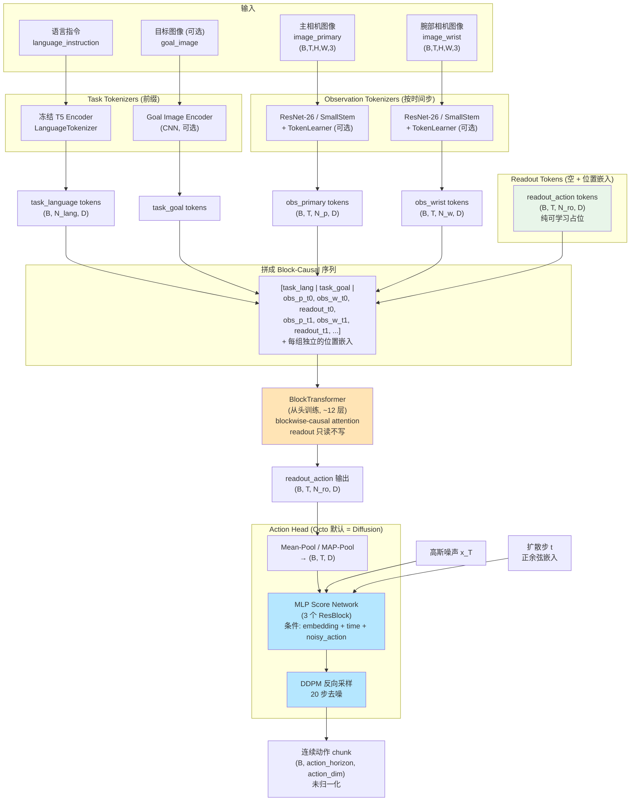
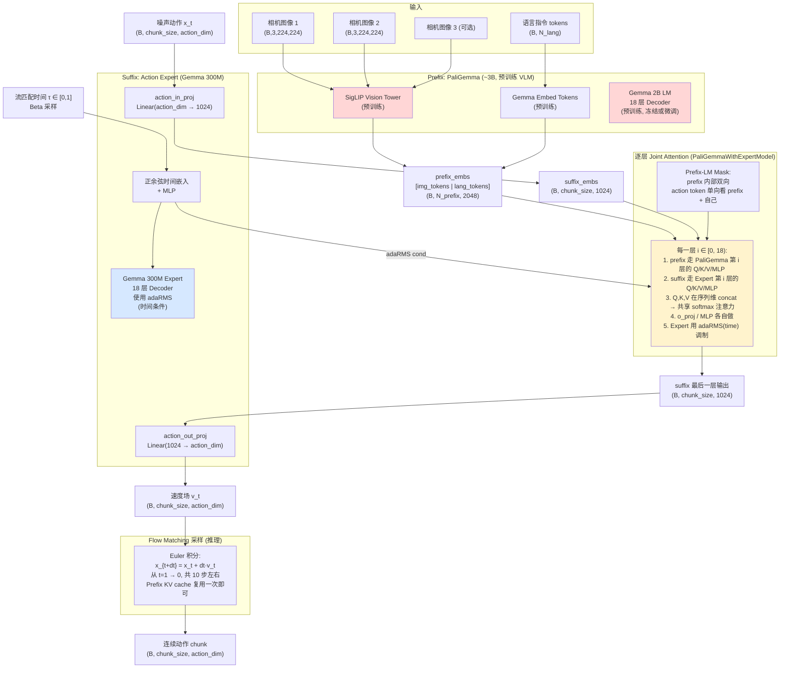

我已经深入分析了两个模型的代码。你的直觉是对的——**Octo 不是 RT-1 那种离散动作 token 化的架构**。下面我从架构本质上把两者讲清楚，并附上 Mermaid 架构图。

---

## 一、纠正一个关键误解：Octo 默认不是离散动作 token

很多人误以为 Octo = "RT-1 风格的离散动作 transformer"，但读 `action_heads.py` 你会发现：

- `octo/model/components/action_heads.py` 里同时实现了 4 种 action head：
  - `ContinuousActionHead`（tanh 回归，MSE/L1）
  - `DiscreteActionHead` / `TokenPerDimActionHead`（RT-1 风格 binning + 分类交叉熵）
  - **`DiffusionActionHead`（DDPM + MLP score network）← 官方 Octo-Base / Octo-Small 发布权重默认用的就是这个**
  - `UNetDDPMActionHead`（DDPM + 1D UNet，类似 Diffusion Policy）

也就是说，**Octo 的"主干 Transformer"只输出一个 `readout` embedding，真正的动作是用一个独立的小型扩散模型（MLP 或 UNet）"解码"出来的**——它本质上更接近"Transformer 编码上下文 + Diffusion Policy 解码动作"，而不是 RT-1 的"自回归离散 token 解码"。

---

## 二、Octo 的真实架构（基于 `octo_module.py`）

核心在 `OctoTransformer.__call__`，序列长这样：

```12:55:/Users/kangkk/Desktop/Project/vla_IL/octo/octo/model/octo_module.py
class OctoTransformer(nn.Module):
    """
    This module forms the base of the Octo architecture.

    The core idea is to run a causal transformer on the following sequence,

        [task, observation 0, observation 1, observation 2, ...]
```

```46:63:/Users/kangkk/Desktop/Project/vla_IL/octo/octo/model/octo_module.py
    Generally, the model runs the transformer on something like the following sequence:

    [
        <task language tokens>,
        <t=0 "image_primary" tokens>, <t=0 "image_wrist" tokens>, <t=0 readout_action tokens>, ...
        <t=1 "image_primary" tokens>, <t=1 "image_wrist" tokens>, <t=1 readout_action tokens>, ...
        ...
    ]
```

几个关键点：

1. **主干 Transformer 是"从头训练"的小 ViT-style Transformer**（不是任何预训练 LLM）。Octo-Small ≈ 27M，Octo-Base ≈ 93M 参数。
2. **语言编码**：用**冻结的 T5**（见 `LanguageTokenizer`）把指令编码成 token 序列，作为前缀 prefix。
3. **图像编码**：每个相机用一个**小型 CNN（ResNet-26/SmallStem）**编码成 patch tokens（可选用 `TokenLearner` 压缩到 N 个 token）。
4. **Readout token**：纯位置嵌入构成的"可学习占位 token"，**它只读不写**（其他 token 看不到它），用于把上下文信息"读出来"喂给 action head。
5. **BlockTransformer**：按"组（task / obs_t / readout_t）"做 block 级因果注意力——同一时间步 obs token 互相全连接，但不能看未来。
6. **动作生成**：把 readout token 做 mean-pool 或 MAP-pool → 拿到一个 embedding → 喂给 `DiffusionActionHead`，跑 20 步 DDPM 反向去噪 → 输出 `(action_horizon, action_dim)` 的连续动作 chunk。

### Octo 架构图



---

## 三、Pi0.5 架构（基于 `modeling_pi05.py`）



---

## 四、Octo vs Pi0.5 架构对比表

| 维度                | **Octo**                                                                                               | **Pi0.5**                                                                                          |
| ----------------- | ------------------------------------------------------------------------------------------------------ | -------------------------------------------------------------------------------------------------- |
| **主干来源**          | 从头训练的 ViT-style Transformer（~27M / ~93M 参数）                                                            | **预训练 PaliGemma**（SigLIP + Gemma 2B，~3B 参数）+ Gemma 300M Action Expert                              |
| **是否依赖预训练 VLM**   | 否（只用了冻结的 T5 编码语言）                                                                                      | 是，强依赖 PaliGemma 的 Web-scale 预训练                                                                    |
| **图像编码器**         | 小型 CNN（ResNet-26 / SmallStem）+ 可选 TokenLearner                                                         | SigLIP ViT（来自 PaliGemma）                                                                           |
| **语言编码器**         | 冻结 T5 encoder 的 hidden states 当作 token                                                                 | Gemma 自己的 embedding 层 + Gemma LM 联合处理                                                              |
| **多模态融合方式**       | 把语言/图像 token **拼成一条长序列**进 Transformer                                                                  | **PaliGemma 内部融合**（图像 token 投影到 LM 嵌入空间）+ Expert 与 LM **逐层 Joint Attention**                       |
| **注意力模式**         | Block-wise **因果**（按 task / obs_t / readout 分组，readout 只读不写）                                            | **Prefix-LM**：prefix 内部双向、action token 单向看 prefix；prefix 与 expert **逐层共享 softmax**                 |
| **历史 / window**   | 原生支持多时间步 history（`window_size`，例如 2）                                                                   | 通常单时间步观察（依赖 chunking 输出未来动作）                                                                       |
| **动作表示**          | **连续值**（默认走 diffusion），非 RT-1 那种离散 bin                                                                 | **连续值**                                                                                            |
| **动作生成方式**        | **独立的扩散小模型**：从 Transformer 拿一个 pooled embedding 作为条件，跑一个 3-block MLP score network + **DDPM 20 步**反向去噪 | **Flow Matching**（rectified flow）：action token 直接作为 Expert 的输入序列，**Expert 即去噪网络本身**，Euler 积分 ~10 步 |
| **时间步条件注入**       | 时间步 t 做正余弦嵌入 → 拼到 MLP score 网络的输入                                                                      | 时间步 τ 做正余弦嵌入 → 通过 **adaRMS**（自适应 RMSNorm 的 scale/gate）注入到 Expert 每一层                               |
| **动作 head 容量**    | 极小（MLP 3 block × 256 dim 或 1D UNet）                                                                    | 巨大（一整个 Gemma 300M，逐层与 2B VLM 交互）                                                                   |
| **Readout 机制**    | 显式的"readout token"占位，从主干"抽取"信息送给小 head                                                                 | 没有 readout，**action token 本身就在 Transformer 里参与计算**                                                 |
| **训练目标**          | DDPM 噪声预测损失（ε-prediction）                                                                              | Flow Matching 速度场损失（u_t = noise - action 的 MSE）                                                    |
| **推理成本**          | 主干跑 1 次 + 小 MLP 跑 20 步（很轻）                                                                             | Prefix 跑 1 次（KV cache）+ Expert 跑 ~10 步（每步要过 18 层 Gemma）                                            |
| **泛化范式**          | "通用机器人 Transformer + Diffusion Policy 解码头"                                                             | "把 VLA 当成 VLM 的延续：用 VLM 做感知-语义，用 Expert 做控制"                                                       |
| **embodiment 适配** | 通过 `unnormalization_statistics` + `action_pad_mask` 适配不同 action_dim                                    | 通过 `max_action_dim` 把所有 embodiment 的动作 pad 到统一维度                                                   |

---

## 五、一句话总结两者本质区别

- **Octo** = "**小 ViT 主干**把多模态上下文压成一个 readout embedding，再用**外挂的 Diffusion Policy（MLP+DDPM）**解码连续动作"。它的智能更多靠**机器人数据**自己学。
- **Pi0.5** = "把**预训练 VLM (PaliGemma)**当作语义大脑，旁边接一个**同结构小 Gemma 作为'手'**，两者**逐层共享注意力**；动作不再是外挂头，而是**直接在 Transformer 内部用 Flow Matching 流式生成**"。它的智能很大一部分来自 **VLM 的 Web 预训练 prior**。

所以你看 `GROOT_N1_DETAILED_ARCHITECTURE.md` 里 GR00T-N1 的 "System 2 (Eagle-2 VLM) + System 1 (DiT Action Expert)" 设计，其实是 **Pi0.5 风格**的延续（VLM 大脑 + 独立动作专家 + Flow Matching），而不是 Octo 风格。Octo 是上一代"中等规模、自训 Transformer + Diffusion Head"路线的代表作。