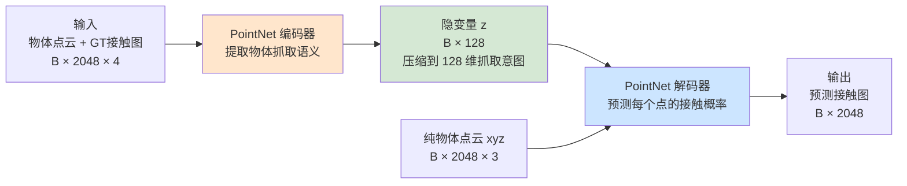

>训练阶段，  Encoder 学习条件后验分布 q(z∣x,C)q(z|x,C)q(z∣x,C)。KL 散度将该后验正则化到先验分布 p(z∣C)p(z|C)p(z∣C)（通常为标准高斯），  从而保证推理阶段可以直接从先验中采样 latent 变量进行生成。

**这是一个非常核心的问题。【“latent space 的法律”：所有 latent 都应该长得像标准高斯】**
* 可以理解为。训练是先用后验概率，训练encoder，在知道真实答案和物体点云的时候，能准确猜出z的抓取意图，然后推理的时候用先验概率，不知道真实答案直接用标准高斯分布随便采样一个，然后再输入物体点云，从而去输出z长什么样
* 后验概率拟合先验概率
整体结构一张图

  

  

**核心思想（30秒理解）**：

- **Encoder** = 把"物体 + 真实抓取信息"压缩成一个 128 维的小向量 z（学到"该怎么抓"）。

- **Decoder** = 给它任意一个 z + 物体点云 xyz，让它"想象出"每个点该不该被抓。

- 训练时 z 由 Encoder 推断；推理时 z 直接从标准正态分布随机采样（这样能生成多样的抓取）。

