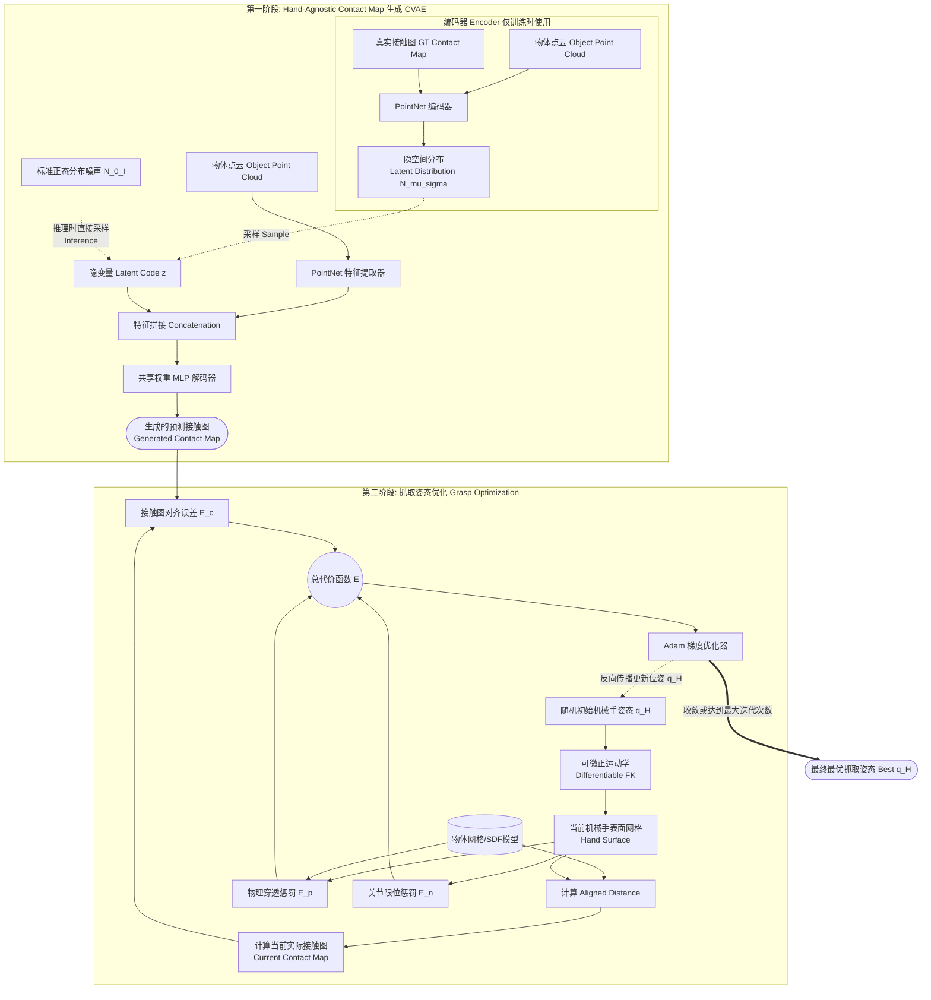

# GenDexGrasp: Generalizable Dexterous Grasping 核心原理解析

  

本文档基于 [GenDexGrasp (arXiv:2210.00722)](https://arxiv.org/pdf/2210.00722) 论文以及 `run_grasp_gen_ros.py` 源码，为你详细解析该算法的网络架构、抓取生成原理，以及其背后庞大的多机械手抓取数据集（MultiDex）的标注与合成方式。

  #架构图
  这是一个描绘 GenDexGrasp 整体网络架构和抓取生成流程的 Mermaid 流程图。它清晰地展示了 **CVAE 接触图生成阶段** 和 **基于梯度的抓取姿态优化阶段**。

### 流程图图解说明：

#### **第一阶段 (Phase 1)：接触图生成**
1. **训练时 (Training)**：把真实的“物体点云”和“真实接触图”输入到 `PointNet 编码器` 中，学到一个高斯隐变量分布 $\mathcal{N}(\mu, \sigma)$。
2. **推理时 (Inference)**：直接从标准正态分布中采样噪声 $z$。
3. **解码过程**：将采样的 $z$ 与经过 `PointNet` 提取的物体点云特征进行逐点拼接，然后用多层感知机（MLP）预测出物体表面每个点被接触的概率，形成一张平滑的**预测接触图 (Generated Contact Map)**。

#### **第二阶段 (Phase 2)：姿态优化（即代码中的 AdamGrasp 部分）**
1. **初始化**：先给目标灵巧手一个随机的 6DoF 基座位置和关节角度 $q_H$。
2. **正运动学 (FK)**：通过可微的前向运动学，得到当前姿态下机械手的 3D 表面点坐标。
3. **对齐距离 (Aligned Distance)**：核心操作！计算当前手部与物体之间的对齐距离，从而映射出**当前的实际接触图**。
4. **能量函数 (Energy Function)**：
   - **$E_c$ (对齐误差)**：计算“当前的实际接触图”与 CVAE “预测接触图”之间的差异。
   - **$E_p$ (穿透惩罚)**：如果机械手插进了物体的 SDF（符号距离场）内部，给与极大的惩罚。
   - **$E_n$ (限位惩罚)**：保证手指关节角度不超过物理极限。
5. **梯度下降更新**：将这三种损失相加得到总代价 $E$，利用 `Adam Optimizer` 对初始的 $q_H$ 进行反复求导和更新（代码里默认 `max_iter=100`），最终输出力学稳定且不穿模的 **最佳抓取姿态 Best $q_H$**。

## 1. 核心网络架构 (Network Architecture)

GenDexGrasp 的核心思想是**将“抓取位姿生成”解耦为两步**：首先生成一个与具体机械手无关的**接触图 (Hand-agnostic Contact Map)**，然后针对特定的目标机械手（如 LejuHand, ShadowHand 等）使用优化算法将机械手“拟合”到这个接触图上。

  

其网络架构主要是一个**条件变分自编码器 (CVAE, Conditional Variational Autoencoder)**：

  

1. **输入表示 (Input)**:

- 物体的 3D 点云 (Object Point Cloud)。

2. **接触图生成 (Contact Map Generation)**:

- **Encoder**: 使用 PointNet 提取物体点云特征以及对应的 Ground-Truth 接触值，将其映射到一个隐空间 (Latent Space) 分布 $\mathcal{N}(\mu, \sigma)$ 中。

- **Decoder**: 采样一个隐变量 $z$，拼接物体点云的逐点特征后送入共享权重的 MLP（多层感知机）。

- **输出**: 为物体表面每个点预测一个概率值 $\hat{\mathcal{C}}(v_o) \in (0,1]$，表示该点被机械手接触的可能性。这就构成了一个密集的**接触图 (Contact Map)**。

3. **架构优势**: 这种生成式的网络不直接输出机械手的关节角，因此完全摆脱了机械手运动学结构的限制（即 Hand-agnostic），从而能泛化到任意的灵巧手上。

  

---

  

## 2. 抓取生成过程 (Grasp Generation via Optimization)

  

网络生成了目标物体表面的“接触图”后，如何将其转换为具体的机械手抓取姿态？这就依赖于代码中 `AdamGrasp` 类的优化过程。

  

### 2.1 能量/代价函数 (Energy Function)

算法使用基于梯度的优化（Adam Optimizer）来迭代更新机械手的位姿 $q_H$（包括手腕的 6DoF 位姿和多指的关节角度）。

在代码中 `energy_func_name='align_dist'` 对应的复合代价函数 $E$ 定义如下：

$$ E(q_H, \hat{\Omega}, O) = E_c(q_H, \hat{\Omega}) + E_p(q_H, O) + E_n(q_H) $$

  

- **$E_c$ (接触图对齐误差)**：计算当前机械手姿态在物体上形成的“实际接触图”与 CVAE “预测接触图” $\hat{\Omega}$ 之间的均方误差。

- **$E_p$ (穿透惩罚)**：惩罚机械手网格（Mesh）与物体网格之间的物理穿透（Penetration）。

- **$E_n$ (关节限位约束)**：确保机械手的关节角度在合法的物理运动学限制内。

  

### 2.2 Aligned Distance（对齐距离）的创新

在计算机械手表面和物体表面点距离时，传统的欧氏距离会在“薄壁物体”上产生歧义（例如捏住杯壁外侧，欧氏距离会认为杯壁内侧也被接触了）。GenDexGrasp 创新地提出了 **Aligned Distance (对齐距离)**：

除了欧氏距离外，它还计算物体表面法向量与手部方向的点积。只有方向对齐（真正面对面接触）的区域才会被标记为有效接触。

  

### 2.3 迭代与输出

如 `run_grasp_gen_ros.py` 所示：

1. 模型加载物体点云和目标接触图（`contact_map_goal`）。

2. `model.run_adam` 启动多粒子（`num_particles=32`）的并行优化。

3. 选取能量最低的最优姿态 `best_q`。

4. 将 `best_q` 分解为手腕的 `PoseStamped` 消息和关节的 `JointState` 消息，并在 ROS 中发布。

  

---

  

## 3. 数据标注：抓取面与力闭合 (Data Annotation via Force Closure)

  

既然网络需要学习接触图，那么海量的、针对各种手型的 Ground-Truth 抓取数据（**MultiDex 数据集**）是如何标注的呢？

GenDexGrasp **并非**使用昂贵的人工动捕（MoCap）去手工采集，而是通过物理与数学结合的**可微优化方法 (Differentiable Force Closure, dfc)** 纯算法自动合成出来的。

  

### 3.1 标注目标

生成具有高多样性、无物理穿透且具备**力闭合 (Force Closure)** 的有效抓取姿态 $q_H$ 及接触点 $X$。

  

### 3.2 可微力闭合评估器 (Differentiable Force Closure, dfc)

传统力闭合计算是离散的、不可微的。论文引入了一个连续可微的力闭合损失函数：

$$ \text{dfc} = Gc $$

- $c$：抓取接触点上的物体表面法向量（假设摩擦力可忽略，指尖仅施加法向力）。

- $G$：抓取矩阵（Grasp Matrix），将每个接触点的力映射到物体质心的总旋量（力与力矩）。

- 当优化使得总旋量为零时，系统达到力闭合平衡状态。

  

### 3.3 自动标注流水线 (Synthesis Pipeline)

1. **初始化**：在给定的机器人灵巧手（如 EZGripper, Allegro, ShadowHand 等 5 种手型）和物体（YCB 等 58 种物体）上随机初始化位姿。

2. **MALA 采样优化**：使用 Metropolis-adjusted Langevin algorithm (MALA) 算法同时优化机械手的位姿 $q_H$ 和手上的接触点 $X$。

3. **最小化联合能量**：

- 最小化 $\text{dfc}$ (确保能抓稳，力闭合)。

- 最小化穿透能量 $E_p$ (确保机械手不穿模)。

- 最小化运动学能量 $E_n$ (确保关节不出界)。

4. **生成 Ground-Truth 接触图**：当一个抓取姿态收敛为成功后，使用上述的 **Aligned Distance**，计算物体表面每个点到机械手的距离，通过 Sigmoid 函数映射到 $(0,1]$，从而生成平滑的 Ground-Truth 接触图（即代码数据集中的 `cmap.pt`）。

  

### 总结

GenDexGrasp 的数据标注不靠人工，而是靠 **物理力学先验 (dfc) + 大规模并行梯度优化**。它用这一套算出来的 43.6 万个多手抓取数据，训练了 CVAE 接触图生成器，从而实现了“跨机械手、高成功率、高多样性”的通用抓取框架。