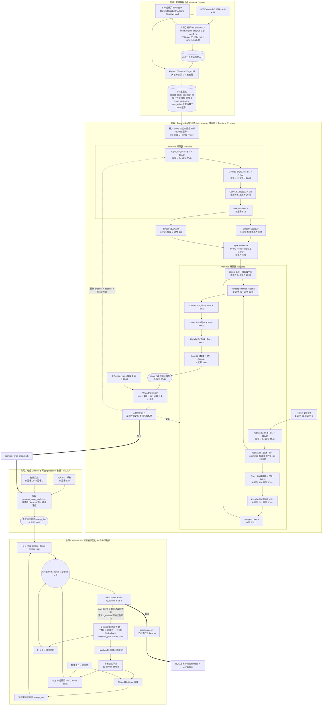

# GenDexGrasp: Generalizable Dexterous Grasping 核心原理解析

  

本文档基于 [GenDexGrasp (arXiv:2210.00722)](https://arxiv.org/pdf/2210.00722) 论文以及 `ros_gendexgrasp/` 项目下的实际源码（`PointNetCVAE.py`、`train_cvae.py`、`train_cvae_criterion.py`、`CMapDataset.py`、`AdamGrasp.py`、`CMapAdam.py`、`run_grasp_gen_ros.py`），为你**逐张量逐维度**地解析该算法的网络架构、训练流程、Ground-Truth 数据的来源，以及推理时的抓取生成原理。

  

---

  

## 0. Ground-Truth 数据从哪里来？（最关键的源头）

  

**结论：GT 物体点云 + GT 接触图 完全由"力闭合优化算法"自动合成，不是人工标注的。**

  

### 0.1 数据文件结构

`CMapDataset.py` (L33–L67) 加载的数据集 `dataset/CMapDataset-sqrt_align/` 下包含两个核心 `.pt` 文件：

  

| 文件 | 内容 | 来源 |

| :--- | :--- | :--- |

| `object_point_clouds.pt` | 每个物体名 → `torch.Tensor[N=2048, 3]` 的点云 | 在 YCB / ContactDB 物体的 mesh 表面均匀采样 2048 个点 |

| `cmap_dataset.pt` | `metadata` 列表，每条 = `(map_value, _, object_name, robot_name)`，`map_value: [N=2048, 1]` | 由 **MultiDex 合成流水线** 离线生成 |

  

读取逻辑（来自 `CMapDataset.__getitem__` L61–L69）：

```python

contact_map = self.object_point_clouds[object_name] + disturbance # B x N x 3 加微小扰动用于数据增广

contact_map = torch.cat([contact_map, map_value], dim=1) # B x N x 4 (xyz + cmap_value)

```

**所以一个样本就是 `[N=2048, 4]` 的张量：前 3 维是物体表面点云 xyz，第 4 维是 0~1 的接触概率。**

  

### 0.2 GT 接触图（cmap_value）是如何被算法标出来的？

不是人工画的，而是按以下流水线**离线合成**：

1. **力闭合采样（dfc + MALA 算法）**：对每一对 `(robot_hand, object)`，跑大规模并行 MALA 优化，使下式最小：

$E_{\text{synth}} = \text{dfc}(q_H, X) + E_p(q_H, O) + E_n(q_H)$

* `dfc = G · c`：抓取矩阵 × 接触法向量，等于零表示力闭合（能稳定抓住）。

* $E_p$：穿透惩罚（用 DeepSDF 近似的 signed distance）。

* $E_n$：关节限位惩罚。

产物：约 43.6 万个 `(机械手 q_H, 接触点集 X)`。

2. **从抓取姿态反算 GT 接触图**：对每一个合成的成功抓取，遍历物体表面所有 2048 个点 $v_o$，用 **Aligned Distance** 计算它到机械手表面的距离：

$\mathcal{D}(v_o, \mathcal{H}) = \min_{v_h \in \mathcal{H}} e^{\gamma (1 - \langle v_o - v_h, n_o \rangle)} \sqrt{\|v_o - v_h\|_2}$

再用 Sigmoid 归一化到 (0, 1]：

$\mathcal{C}(v_o) = 1 - 2 (\text{Sigmoid}(\mathcal{D}) - 0.5)$

3. **存储为 `map_value`**，写入 `cmap_dataset.pt`。

  

**关键洞察：在这条流水线里，`机械手 q_H` 只是中间产物，最终落盘进网络训练的只有 `(物体点云, 物体接触图)` 一对——这就是 GenDexGrasp 实现"hand-agnostic"的根本原因：训练集里根本不带机械手的关节角！**

  

---

  

## 1. PointNetCVAE 网络的精确架构与张量维度

  

下面所有维度都对应 `train_cvae.py` (L246–L251) 中的实例化配置和 `PointNetCVAE.py` 的代码实现。

  

| 超参数 | 值 |

| :--- | :--- |

| 点云点数 N | 2048 |

| 隐变量维度 latent_size | 128 |

| 全局特征维度 | 512 |

| Batchsize | 4 |

| Optimizer | Adam (`lr=1e-4`, betas=(0.9, 0.999)) |

| 损失权重 | `lw_recon=100, lw_kld=1` |

  

### 1.1 Encoder（仅训练时使用）

`PointNetEncoder` 是经典的 PointNet 全局特征提取器（共享权重 1D Conv + max-pool）。

```

输入: object_cmap 维度 [B, N=2048, 4] (xyz + GT cmap_value)

-> transpose [B, 4, 2048]

-> Conv1d(4 → 64) + BN + ReLU [B, 64, 2048]

-> Conv1d(64 → 128) + BN + ReLU [B, 128, 2048]

-> Conv1d(128 → 512) + BN [B, 512, 2048]

-> max-pool over N [B, 512]

两个 Linear 头并联:

-> Linear(512 → 128) means [B, 128]

-> Linear(512 → 128) logvars [B, 128]

重参数化:

z = means + eps * exp(0.5 * logvars), eps ~ N(0, I) z [B, 128]

```

  

### 1.2 Decoder（训练与推理都使用）

`PointNetDecoder` 是两条支路 + 一条合并支路：

```

输入: object_pts [B, N=2048, 3] (仅 xyz，不带 cmap_value)

z_latent_code [B, 128]

  

支路① Pointwise Feature (PointNet 风格)

-> transpose [B, 3, 2048]

-> Conv1d(3 → 64) + BN + ReLU [B, 64, 2048]

-> Conv1d(64 → 64) + BN [B, 64, 2048] 保留为 pointwise_feat

  

支路② Global Feature (从 pointwise_feat 继续聚合)

-> Conv1d(64 → 128) + BN + ReLU [B, 128, 2048]

-> Conv1d(128 → 512) + BN [B, 512, 2048]

-> max-pool over N [B, 512]

-> concat z [B, 512 + 128] = [B, 640]

-> 复制到每个点（broadcast） [B, 640, 2048]

  

支路③ Merge & Decode

-> concat pointwise_feat + global_z [B, 64 + 640 = 704, 2048]

-> Conv1d(704 → 512) + BN + ReLU [B, 512, 2048]

-> Conv1d(512 → 64) + BN + ReLU [B, 64, 2048]

-> Conv1d(64 → 64) + BN + ReLU [B, 64, 2048]

-> Conv1d(64 → 1) + BN [B, 1, 2048]

-> Sigmoid [B, 2048] ← 这就是预测接触图 cmap_values_hat

```

  

### 1.3 Frozen / Fine-tune 状态

**答：整个 PointNetCVAE 训练时全部参数都参与梯度反传，没有 frozen 模块。**

证据见 `train_cvae.py` L256：

```python

optimizer = optim.Adam(model.parameters(), lr=args.lr, ...) # 全部 parameters 都更新

```

* 训练时：Encoder + Decoder + 两个 Linear 头 **全部参与训练**（联合 fine-tune）。

* 推理时（`PointNetCVAE.inference()` L151–L158）：**Encoder 完全不用**，只用 Decoder，并把 z 替换成 $z \sim \mathcal{N}(0, I)$ 的随机采样。

* 后阶段的抓取优化（`AdamGrasp` / `CMapAdam`）：**网络权重完全冻结**，只对机械手姿态 `q_H` 求导。

  

### 1.4 训练损失函数

来自 `train_cvae_criterion.py`，标准 CVAE 的 ELBO：

$\mathcal{L} = \lambda_{\text{recon}} \cdot \sqrt{\text{MSE}(\hat{\Omega}, \Omega)} + \lambda_{\text{kld}} \cdot D_{KL}(\mathcal{N}(\mu, \sigma) \| \mathcal{N}(0, I))$

  

具体到代码（L29–L32）：

* `loss_kld = -0.5 * sum(1 + logvars - means^2 - exp(logvars))`

* `loss_recon = sqrt(mean((cmap_gt - cmap_hat)^2))`

* `loss = 1 * loss_kld + 100 * loss_recon`

  

`VAEAttnCriterion` 是个增强版：把 reconstruction loss 用 $e^{\alpha \cdot \mathcal{C}_{gt}}$ 加权，让网络更关注接触概率高的区域。

  

---

  

## 2. 训练流水线 (`train_cvae.py`)

  

```

1. 数据加载 CMapDataset(dataset/CMapDataset-sqrt_align/, mode='train')

→ DataLoader(batch_size=4)

2. 模型初始化（从零训练，无预训练权重）

model = PointNetCVAE(latent_size=128, ...)

注释: "init PointNet-CVAE model from scratch..." (L245)

3. 优化器 Adam(lr=1e-4)，模型全部参数都更新

4. 训练循环 (n_epochs=1～36)

每个 batch:

cmap [B, 2048, 4]

┌→ encoder forward → means, logvars

├→ reparameterize → z

├→ decoder forward(xyz, z) → cmap_hat [B, 2048]

├→ criterion → loss_recon + loss_kld

└→ optimizer.step() （**整网联合反传**）

5. 验证 + 保存最佳权重 pointnet_cvae_model.pth

```

  

---

  

## 3. 推理 → 抓取优化全流程（`run_grasp_gen_ros.py`）

  

### 3.1 阶段 A：用 Decoder 生成接触图

1. 加载 `cmap.pt` 数据集（这里复用了与训练一致的 GT 数据格式，但实际只读 xyz + cmap_value 作为 contact_map_goal）。

2. 从 `cmap_dataset` 取出 `(object_point_cloud, contact_map_value)` 作为目标接触图（`contact_map_goal` 维度 `[N=2048, 4]`，前 3 维是 xyz，第 4 维是接触概率）。

3. 若用纯生成模式（如 `inf_cvae.py`），则直接调用 `model.inference(object_pts, z)`，从标准正态采样新 z。

4. 输出: $\hat{\Omega}(\mathcal{O}) = \{\hat{\mathcal{C}}(v_o)\}_{v_o \in \mathcal{O}}$, 维度 `[N=2048]`。

  

### 3.2 阶段 B：把机械手"拟合"到接触图（`AdamGrasp` + `CMapAdam`）

来自 `CMapAdam.py` L94，机械手姿态 `q_current` 是这样定义的：

```python

self.q_current = torch.zeros(num_particles, 3 + 6 + len(revolute_joints))

# ↑ ↑ ↑

# 平移(3) 6D旋转表示(6) 关节角(N)

```

对于 `lejuhand`（论文之外的乐聚灵巧手），关节数为 10，因此 `q ∈ R^{32 × 19}`（32 个并行粒子）。

  

#### 优化代价函数

$E(q_H, \hat{\Omega}, O) = E_c(q_H, \hat{\Omega}) + E_p(q_H, O) + E_n(q_H)$

  

* $E_c$：当前姿态下，用 **Aligned Distance** 计算的"实际接触图" $\dot{\Omega}$ 与 $\hat{\Omega}$ 的 MSE。

* $E_p$：手部表面采样点和物体 SDF 之间的穿透量（用 ReLU 取负值）。

* $E_n$：关节角度超出 `q_joint_lower / q_joint_upper` 的违规量。

  

#### 迭代过程

* 优化器: `torch.optim.Adam(q_current, lr=5e-3)`

* 粒子数: 32（并行优化避免局部极小）

* 迭代轮次: `max_iter=100`

* `AdamGrasp.run_adam()` 反复调用 `opt_model.step()`，最后选 `energy.argmin()` 的那一条粒子作为 `best_q`。

  

---

  

## 4. 完整架构图

  

下面这张图把所有训练 / 推理 / 优化阶段、张量维度、frozen 状态都标出来了。

  



  

---

  

## 5. 训练时 / 推理时 / 优化时 — Frozen 状态速查表

  

| 阶段 | Encoder | Decoder | Linear z_means / z_logvars | 机械手 q_H |

| :--- | :---: | :---: | :---: | :---: |

| **训练 CVAE** (`train_cvae.py`) | trainable (loss 反传) | trainable (loss 反传) | trainable (loss 反传) | 不参与（数据集里就没有手的关节角） |

| **推理生成接触图** (`inference`) | **不使用** | **FROZEN** (权重加载自 ckpt) | **不使用** | 不参与 |

| **抓取姿态优化** (`AdamGrasp`) | **不使用** | **FROZEN**（仅前向用其输出 $\hat{\Omega}$ 作为优化目标） | **不使用** | **唯一 trainable**：`q_current.requires_grad = True`，Adam lr=5e-3 |

  

---

  

## 6. 总结与三个核心创新点

  

| # | 创新 | 实现位置 | 作用 |

| :--- | :--- | :--- | :--- |

| 1 | **Hand-agnostic 中间表示** | `cmap_dataset.pt` 只存 `(object_pts, cmap_value)` | 让网络与具体机械手解耦，泛化到新手型 |

| 2 | **Aligned Distance** | `CMapAdam.compute_energy_align_dist` | 解决薄壁物体两侧接触歧义 |

| 3 | **dfc + MALA 力闭合自动合成** | MultiDex 数据集合成（离线流水线） | 摆脱昂贵的人工 MoCap 数据采集，43.6 万样本全自动生成 |

  

GenDexGrasp 在工程上把"如何抓"这个高难度问题分解为两个**独立可解、各自最优**的子问题：

- **网络只学"应该碰哪里"**（CVAE 生成 hand-agnostic 接触图，纯数据驱动）。

- **优化只学"怎么把手凑过去碰那里"**（Adam 基于代价函数纯几何/物理求解，与机械手类型无关）。

这种解耦让训练成本大幅降低，并具备开箱即用的跨机械手泛化能力。