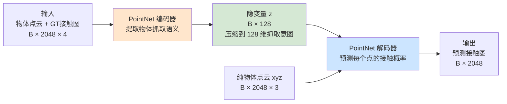
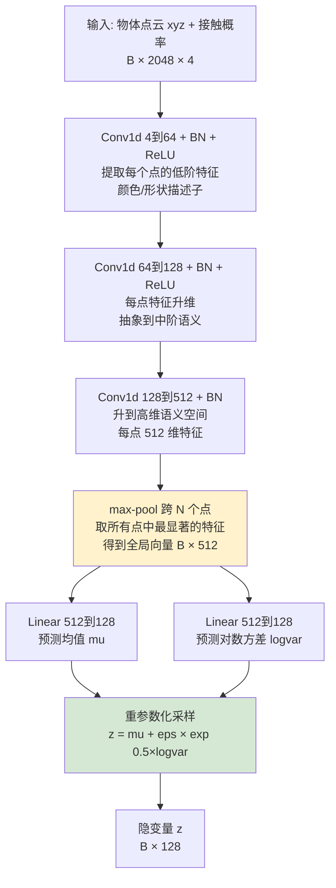
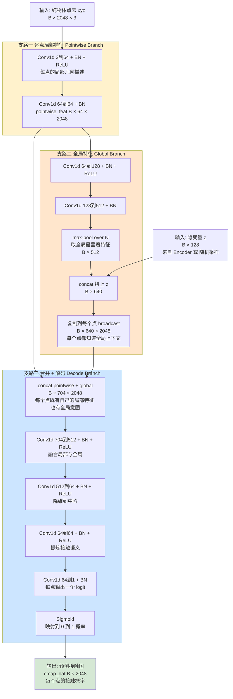
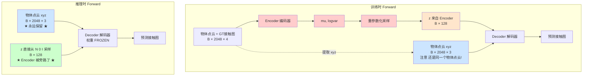
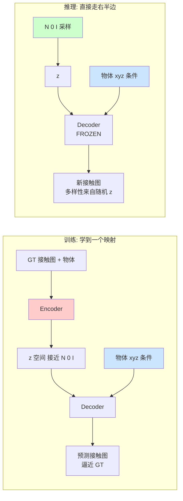
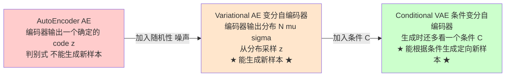

# PointNetCVAE 简易架构图解

  

> 本文档是 `GenDexGrasp_Architecture.md` 的简化版，专门为快速理解 `utils_model/PointNetCVAE.py` 的网络结构而写。这里**只关注网络本身**，不涉及数据合成或后端优化。

  

---

  

## 1. 整体结构一张图

  



  

**核心思想（30秒理解）**：

- **Encoder** = 把"物体 + 真实抓取信息"压缩成一个 128 维的小向量 z（学到"该怎么抓"）。

- **Decoder** = 给它任意一个 z + 物体点云 xyz，让它"想象出"每个点该不该被抓。

- 训练时 z 由 Encoder 推断；推理时 z 直接从标准正态分布随机采样（这样能生成多样的抓取）。

  

---

  

## 2. Encoder：物体抓取语义提取器

  



  

### 每一层在做什么？

| 层 | 作用（人话版） |

| :--- | :--- |

| **Conv1d(4→64)** | 把每个点的 `(x,y,z,接触值)` 编成 64 维的"局部抓取描述" |

| **Conv1d(64→128)** | 继续升维，让特征能表达更复杂的几何意义（比如"这是把手"） |

| **Conv1d(128→512)** | 升到 512 维高级语义空间 |

| **max-pool** | **PointNet 的灵魂**：在 2048 个点中，每个特征通道只保留最大值——天然对点云顺序无关 |

| **Linear → μ, logσ²** | 拟合一个高斯分布 $\mathcal{N}(\mu, \sigma)$，描述"该物体可能的抓取方式" |

| **reparameterize** | VAE 的标准技巧：从分布里采样 z，但保持梯度可传 |

  

> **直觉**：Encoder 把"整个物体和它的抓取热图"压缩成一个 128 维的小向量，相当于"看了一眼这把杯子知道大概要捏哪儿"。

  

---

  

## 3. Decoder：每点接触概率预测器

  

Decoder 的结构最复杂，它有**三条支路**：**逐点特征支路、全局特征支路、解码合并支路**。

  



  

### 三条支路分别在做什么？

| 支路 | 角色 | 类比 |

| :--- | :--- | :--- |

| **支路一（Pointwise）** | 看每个点的**局部**几何信息 | 像"用放大镜看每个像素" |

| **支路二（Global+z）** | 算物体**全局**形状，并把 z 注入全局意图 | 像"读懂整张图，并根据指令决定主题" |

| **支路三（Merge+Decode）** | 把局部 + 全局上下文 + 抓取意图 **逐点融合**，输出每个点的接触概率 | 像"决定每个像素该涂多深的红色（=越红越要抓）" |

  

### 为什么要全局 + 局部？

- 只看局部 → 不知道全局上下文（杯子的把手和瓶身可能局部很像）。

- 只看全局 → 失去逐点精度（不知道具体到哪个点该被抓）。

- **二者结合 + z 控制意图 = 既知道"哪类点该被抓"，又知道"具体哪几个点"。**

  

---

  

## 4. 训练 vs 推理 vs 抓取优化（一张表搞清楚）

  

| 用法 | Encoder | z 来源 | Decoder | 反向传播什么？ |

| :--- | :---: | :--- | :---: | :--- |

| **训练 CVAE** | ✅ 使用 | Encoder 推断 + 重参数化 | ✅ 使用 | **网络全部权重** (Adam lr=1e-4) |

| **推理生成新接触图** | ❌ 不用 | 从 $\mathcal{N}(0, I)$ 随机采样 | ✅ 使用（FROZEN）| 不反传，纯前向 |

| **抓取姿态优化** | ❌ 不用 | 不需要（直接用接触图作为目标）| ✅ 使用（FROZEN）| 只反传**机械手 q_H** (Adam lr=5e-3) |

  

---

  

## 5. 常见误区 Q&A

  

### Q1：为什么训练时 Decoder 既要吃 z，又要吃纯物体点云 xyz？

  

因为这是一个 **CVAE (Conditional VAE)**，C 代表 Conditional，"条件"。

- **Decoder 学到的不是"凭空生成一张接触图"**。

- **Decoder 学到的是"在给定物体形状的条件下，生成与这个形状匹配的接触图"**。

  

数学上写就是 $p_\varphi(\Omega | z, O)$：

- $\Omega$ = 接触图（输出）。

- $z$ = 抓取意图（隐变量，控制"抓哪种类型"）。

- **$O$ = 物体（条件，决定"在哪个表面上画图"）**。

  

**没有 $O$，Decoder 根本不知道往哪 2048 个点上预测概率值，输出的张量没有几何意义！**

  

打个直白的比方：

- $z$ = "我要画一只猫" 的指令。

- $O$ = "在这张白纸上"。

- 输出 = 一张画了猫的纸。

- 你不能省略"白纸"，否则猫画到哪儿？

  

---

  

### Q2：推理的时候是不是把"物体点云 xyz"替换成高斯分布了？

  

**不是！物体点云 xyz 在训练和推理时永远都是 Decoder 的输入，绝对不会被替换。**

  

被高斯分布 $\mathcal{N}(0, I)$ 替换的是 **z（隐变量）的来源**：

  



  

---

  

### Q3：推理时被旁路（去掉）的到底是什么？

  

| 模块 | 训练时 | 推理时 |

| :--- | :--- | :--- |

| 物体点云 xyz | ✅ 使用 | ✅ **依然使用**（永远不会丢） |

| GT 接触图（第 4 维） | ✅ 使用（喂给 Encoder） | ❌ **丢弃**（推理时根本不知道答案） |

| Encoder | ✅ 推断 $\mu, \sigma$ | ❌ **完全旁路** |

| 两个 Linear 头 (μ, logσ²) | ✅ 输出分布参数 | ❌ **完全旁路** |

| 重参数化 (μ + ε·σ) | ✅ 从推断分布采样 | ❌ **被替换** |

| **z 的来源** | Encoder 推断的分布 | **直接从 $\mathcal{N}(0, I)$ 随机采样** |

| Decoder | ✅ 使用 | ✅ 使用（权重 FROZEN） |

  

代码证据（`PointNetCVAE.py` L138–L158）：

```python

def forward(self, object_cmap): # 训练用

means, logvars = self.forward_encoder(object_cmap) # 走 Encoder

z = self.reparameterize(means, logvars) # 用 Encoder 推断的分布

return self.forward_decoder(object_cmap[:, :, :3], z) # Decoder 吃 xyz + z

  

def inference(self, object_pts, z_latent_code): # 推理用

return self.forward_decoder(object_pts, z_latent_code) # Decoder 还是吃 xyz + z（但 z 是外部传入的随机噪声）

```

  

---

  

### Q4：为什么这么设计？深层意义是什么？

  

**核心规律**：训练时整个左半边 Encoder 链路是为了"把后验分布 $q_\varphi(z|\Omega, O)$ 学得接近先验 $\mathcal{N}(0, I)$"（KL 散度项的作用）。一旦训练完成，左半边就完成了它的使命可以丢掉了——因为它把 z 空间整理得很规整，推理时从 $\mathcal{N}(0, I)$ 随便采样都能落在 Decoder 见过的合理区域。

  

#### ① 训练阶段：Encoder 给 Decoder "划重点"

训练时如果让 Decoder 凭空随机采 z，模型很难学到"什么样的 z 对应什么样的接触图"。所以训练时让 **Encoder 看着 GT 接触图，"作弊"地告诉 Decoder："这个抓取意图对应的 z 应该长 μ, σ 这样"**。这样 Decoder 能高效地学到 z 与接触图的对应关系。

  

#### ② KL 散度的约束：把 z 空间规整化

损失函数里的 $\lambda_{kld} \cdot D_{KL}(\mathcal{N}(\mu, \sigma) \| \mathcal{N}(0, I))$ 强迫 Encoder 输出的分布接近标准正态。这就保证了 z 空间是"密集且光滑的"，没有"空洞"。

  

#### ③ 推理阶段：丢掉 Encoder 自由采样

因为 z 空间已被整理得跟 $\mathcal{N}(0, I)$ 几乎一样了，**所以推理时随便从 $\mathcal{N}(0, I)$ 采样一个 z，喂给 Decoder，就能生成一个合理的接触图**——而且因为是随机采的，每次都能得到不同的抓取方式（这就是论文强调的 **diversity**）。

  

---

  

### 训练 / 推理对称性总图

  



  

**记住这句话**：训练时 Encoder 把 GT 接触图编码成"教学专用的 z"传给 Decoder；推理时 Encoder 退场，直接用随机 z 让 Decoder 自由发挥。而**物体点云 xyz 永远是 Decoder 的输入条件**——这是 Conditional VAE 与普通 VAE 最本质的区别。

  

---

  

## 6. 附录：AE vs VAE vs CVAE 区别速通

  

### 6.1 三者的进化关系

  



  

### 6.2 AE → VAE：加入随机性

  

**AE 的问题**：编码器直接输出一个确定的 code，相当于把每个样本压成隐空间里的一个**点**。隐空间是离散的、有"空洞"的，所以从两个点之间随便取一个 z 解码，往往输出垃圾。**AE 是判别式模型，不具备生成能力。**

  

**VAE 的改进**：编码器不再输出一个点，而是输出**一组正态分布的参数 $(\mu_i, \sigma_i)$**。从分布中采样 z，相当于把每个样本变成隐空间里的一**团**。这样隐空间被铺满，能在团之间插值，从而具备**生成新样本的能力**。

  

VAE 的损失函数有两项：

1. **重建损失** $\text{MSE}(\hat{x}, x)$：让 Decoder 还原得越接近原图越好。

2. **KL 散度** $D_{KL}(\mathcal{N}(\mu, \sigma) \| \mathcal{N}(0, I))$：**这一项至关重要**！如果只优化重建，模型会学到让 $\sigma \to 0$ 把分布退化成一个点，VAE 就退化成 AE 了。KL 散度强制每个样本的分布都向标准正态靠近，**保证隐空间是连续、规整、可采样的**。

  

$\mathcal{L}_{\text{VAE}} = \text{MSE}(\hat{x}, x) + \lambda \cdot D_{KL}(\mathcal{N}(\mu, \sigma) \| \mathcal{N}(0, I))$

  

### 6.3 VAE → CVAE：加入条件

  

**回到你的问题：CVAE 与 VAE 的区别，确实就是多了一个"条件 condition"！** 但这个"多一个条件"带来了本质性的功能升级。

  

| 维度 | VAE | CVAE |

| :--- | :--- | :--- |

| 训练目标 | $p(x)$ 学习数据本身的分布 | $p(x \| C)$ 学习"给定条件下"的数据分布 |

| Encoder 输入 | 只看 $x$ | 看 $(x, C)$ 联合 |

| Decoder 输入 | 只用 $z$ 生成 | 用 $(z, C)$ 生成 |

| 推理能力 | 随机生成"任意"新样本 | 根据条件生成"定向"新样本 |

| 类比 | "随机抽奖：给我画一张图" | "点菜：给我画一张猫" |

  

CVAE 的 ELBO 公式：

$\log p(x | C) \geq \mathbb{E}_{z \sim q(z|x,C)}[\log p(x | z, C)] - D_{KL}(q(z|x,C) \| p(z|C))$

  

在实际实现里通常简化成 $p(z|C) \approx \mathcal{N}(0, I)$（条件先验直接用标准正态）。

  

### 6.4 对应到 GenDexGrasp 的 PointNetCVAE

  

把上述公式具象化：

| 符号 | 在 GenDexGrasp 里的含义 |

| :--- | :--- |

| $x$ | GT 接触图 $\Omega$（向量维度 2048） |

| $C$ | **物体点云 $O$**（B × 2048 × 3） |

| $z$ | 抓取意图（128 维隐变量） |

| $q(z\|x, C)$ | Encoder：看着 GT 接触图 + 物体，推断 $\mu, \sigma$ |

| $p(x\|z, C)$ | Decoder：根据 z + 物体，预测每点接触概率 |

  

具体的损失函数（来自 `train_cvae_criterion.py`）：

$\mathcal{L} = 100 \cdot \sqrt{\text{MSE}(\hat{\Omega}, \Omega)} + 1 \cdot D_{KL}(\mathcal{N}(\mu, \sigma) \| \mathcal{N}(0, I))$

  

跟你笔记里 VAE 的 loss 是同一个套路，只是：

- 重建损失换成了 sqrt(MSE)（或带 attention 加权的版本）。

- KL 散度形式完全不变。

- **多了一个条件 $O$ 输入到 Encoder 和 Decoder 里**——这就是 "C" of CVAE。

  

### 6.5 为什么必须是 CVAE 而不是 VAE？

  

如果只用普通 VAE（不带物体条件）会发生什么？

- Encoder 把 GT 接触图压成 z，Decoder 从 z 还原接触图。

- 但**接触图的"位置含义"依赖于物体的几何**。同一个 z 对一个杯子的意义和对一把刀的意义完全不同。

- 没有条件 $O$，Decoder 不知道这 2048 个点该贴到什么物体上，**生成的接触图就失去了几何意义**，无法用于后续抓取优化。

  

所以 GenDexGrasp 必须用 **CVAE**：**物体点云作为强制条件，永远跟着 z 一起喂进 Decoder**。

  

---

  

## 7. 一句话总结

  

> **PointNetCVAE = "PointNet 编码全局 + 局部点云特征" + "CVAE 学习抓取意图的隐空间分布" + "条件解码每点接触概率"**

  

它做的事情非常单纯：**给一个物体，告诉我每个表面点该不该被抓**（输出一张接触热力图）。而"具体哪只手怎么抓"则完全交给后面的 Adam 几何优化阶段解决——网络与机械手彻底解耦，这就是 **Hand-Agnostic** 的精髓。