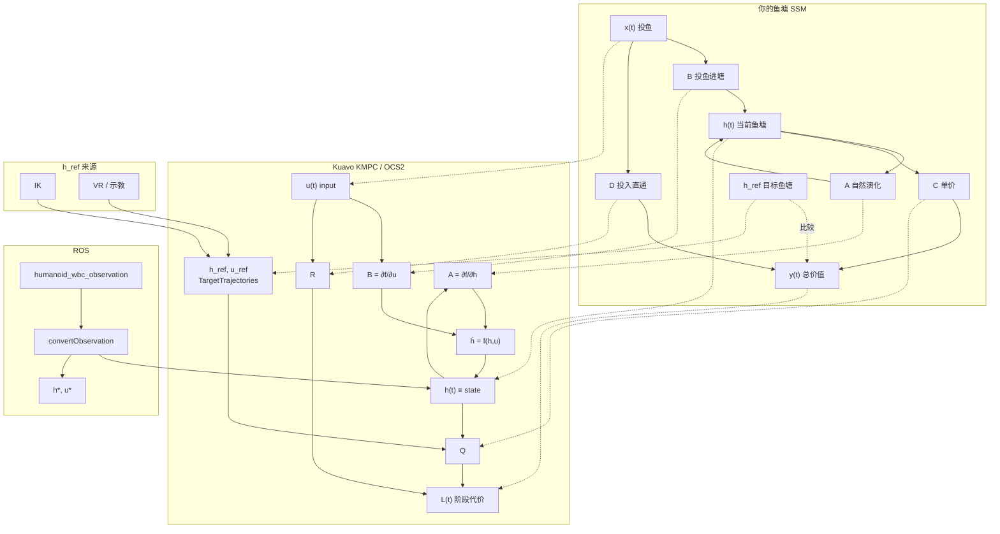

## 一、符号对照（先看这张表）

你的手绘图与 OCS2/KMPC **符号名不同**，物理含义如下：

| 你的鱼塘图 | 含义 | KMPC / OCS2 | 典型代码 |
|-----------|------|-------------|----------|
| $$h(t)$$ | 鱼塘当前状态 | $$x(t)$$，`state` | `SystemObservation.state` |
| $$x(t)$$ | 投鱼 / 外部操作 | $$u(t)$$，`input` | `SystemObservation.input` |
| $$y(t)$$ | 鱼塘「总价值」 | 阶段代价 $$L(t)$$（**要最小化**） | `QuadraticStateInputCost::getValue` |
| $$A$$ | 状态矩阵（自然演化） | $$\dfrac{\partial f}{\partial h}$$ | `linearApproximation.dfdx` |
| $$B$$ | 操作矩阵（输入进塘） | $$\dfrac{\partial f}{\partial u}$$ | `linearApproximation.dfdu` |
| $$C$$ | 状态→价值 | 跟踪权重 $$Q$$、末端雅可比 $$\dfrac{\partial g}{\partial h}$$ | `QuadraticBaseStateCost`、`EndEffectorConstraint` |
| $$D$$ | 输入直通→价值 | 输入权重 $$R$$ | `QuadraticInputCost` |
| $$h_{\mathrm{ref}}$$ | 目标鱼塘（见第六节） | `TargetTrajectories` 期望状态 | IK / VR / 示教 → `setTargetTrajectories` |

---

## 二、KMPC 在用什么模型？

Kuavo 移动操作臂 KMPC 基于 **OCS2 最优控制**，核心是：

1. **连续时间状态空间**（flow map）  
2. **非线性**（轮式等机型）或 **极简线性**（全驱动浮动基座）  
3. **MPC** 在预测时域上离散、每步线性化后用 SQP / DDP 求解  

**不是**固定 LTI 的 $$h(t)=Ah(t-1)+Bx(t)$$，而是先写 $$\dot h = f(h,u)$$，再在网格上近似为离散形式。

---

## 三、状态方程：$$h(t)$$、$$A$$、$$B$$

### 3.1 你图中的离散形式

$$
h(t) = A\,h(t-1) + B\,x(t)
$$

- $$A\,h(t-1)$$：不投鱼也会变（繁殖、死亡等）  
- $$B\,x(t)$$：本步投鱼带来的变化  

### 3.2 OCS2 中的连续形式

$$
\dot h(t) = f\bigl(h(t),\, u(t)\bigr)
$$

线性化（每个 MPC 节点、每次迭代）：

$$
\delta\dot h \approx A(t)\,\delta h + B(t)\,\delta u,
\quad
A(t)=\frac{\partial f}{\partial h},\;
B(t)=\frac{\partial f}{\partial u}
$$

离散化（步长 $$\Delta t$$，多点射击）近似为：

$$
h_{k+1} \approx h_k + \Delta t\, f(h_k,u_k)
\;\Rightarrow\;
h_{k+1} \approx A_d\, h_k + B_d\, u_k
$$

### 3.3 Kuavo 配置（`manipulatorModelType = 3`，全驱动浮动基座）

动力学实现为：

$$
\dot h = u
$$

对应代码：`FullyActuatedFloatingArmManipulatorDynamics::systemFlowMap` 直接 `return input`。

因此（连续线性化）：

$$
A \approx 0, \qquad B \approx I
$$

离散一步（欧拉）：

$$
h_{k+1} \approx h_k + \Delta t\, u_k
\;\Rightarrow\;
A_d \approx I,\; B_d \approx \Delta t\, I
$$

### 3.4 $$h(t)$$ 里装什么？

$$h$$ 的维数 `stateDim = model.nq`（Pinocchio 广义坐标），**不是** $$\begin{bmatrix}q\\ \dot q\end{bmatrix}$$ 二阶增广状态。

| 分量 | 物理含义 |
|------|----------|
| $$h_{0:5}$$ | 基座：$$x,y,z$$ + ZYX 欧拉角 |
| $$h_{6:}$$ | 腰 + 双臂关节角 |

实测来自 `/humanoid_wbc_observation`，经 `convertObservationfromHumanoid2MM` 映射为 MM 的 `state`。

### 3.5 $$A$$、$$B$$ 在鱼塘里分别是什么？

| 矩阵 | 鱼塘类比 | 全驱动 KMPC |
|------|----------|-------------|
| **$$A$$** | 塘内自然演化（繁殖/死亡） | $$\approx 0$$（状态不会自己变，只靠积分 $$\int u\,dt$$） |
| **$$B$$** | 投鱼改变库存 | $$\approx I$$（控制速度 $$u$$ 直接等于 $$\dot h$$） |

轮式机型时 $$f$$ 含 $$\cos\theta,\sin\theta$$，$$A,B$$ 随 $$h$$ 变化，不再是常数矩阵。

---

## 四、价值方程：$$y(t)$$、$$C$$、$$D$$

### 4.1 你图中的形式

$$
y(t) = C\,h(t) + D\,x(t)
$$

### 4.2 KMPC 里没有单独的「物理输出 $$y$$」

优化的是**代价**（越小越好）：

$$
J = \int_{t_0}^{t_f} L\bigl(h,u\bigr)\,dt + L_f(h_T)
$$

阶段代价（`QuadraticStateInputCost`）：

$$
L = \frac{1}{2}(h-h_{\mathrm{ref}})^\top Q (h-h_{\mathrm{ref}})
+ \frac{1}{2}(u-u_{\mathrm{ref}})^\top R (u-u_{\mathrm{ref}})
$$

（交叉项 $$P$$ 在本项目里多为 0。）

| 你的量 | KMPC 对应 | 配置 / 代码 |
|--------|-----------|-------------|
| $$y(t)$$ | $$L(t)$$（惩罚，非「产值」） | 各 `cost` / `softConstraint` 的 `getValue` |
| **$$C$$** | $$Q$$：基座跟踪；$$\dfrac{\partial g}{\partial h}$$：末端位姿误差 | `stateCost.Q`、`EndEffectorConstraint` |
| **$$D$$** | $$R$$：直接惩罚 $$u$$ | `inputCost.R`、`QuadraticInputCost` |

末端位姿（非线性「输出」）：

$$
e_{\mathrm{ee}} = g(h) - h_{\mathrm{ee,ref}}
$$

$$g$$ 为 Pinocchio 正运动学；$$h_{\mathrm{ee,ref}}$$ 由参考轨迹插值得到，不是 $$h$$ 的一个子向量。

---

## 五、ROS → MPC 数据流（有条理）

1. **观测**：`/humanoid_wbc_observation` → 当前 $$h_{\mathrm{meas}}$$（及人形侧速度信息）  
2. **映射**：`convertObservationfromHumanoid2MM` → MM 的 $$h,\,u$$  
3. **注入 MPC**：`mpcMrtInterface_->setCurrentObservation(obs)`  
4. **动力学**：$$\dot h = f(h,u)$$，求 $$A=\partial f/\partial h$$，$$B=\partial f/\partial u$$  
5. **代价**：用 $$h_{\mathrm{ref}},u_{\mathrm{ref}}$$ 算 $$L$$（含 $$Q,R$$ 与末端/碰撞软约束）  
6. **求解**：`SqpMpc` / `GaussNewtonDDP_MPC`  
7. **输出**：`nextState` $$h^*$$、`optimizedInput` $$u^*$$  
8. **下发**：`controlHumanoid` → `humanoid_mpc_target_*`、`arm_traj`、`cmd_pose` 等  

控制器文件本身**不实现** $$f,A,B,Q,R$$；这些在 `ocs2_mobile_manipulator` + `MobileManipulatorInterface` 中。

---

## 六、$$h_{\mathrm{ref}}$$ 在你的鱼塘图里对应哪一块？

### 6.1 直接回答

**$$h_{\mathrm{ref}}$$ 不是 $$x(t)$$（投鱼），也不是 $$A\cdot h(t-1)$$（自然演化）。**

它对应你图里应单独画的一块：

> **「目标 / 标准鱼塘」——希望塘里最终有多少鱼（什么品种、多少数量）**

用虚线连到 **价值侧**（你和 $$h(t)$$ 比较，决定 $$y(t)$$ 高低），**不要**画进 $$A$$、$$B$$ 的动力学箭头。

### 6.2 和鱼塘各量的关系（文字图）

```text
  [IK / VR / 示教 / task.info]
           │
           ▼
      h_ref(t)  ───「标准鱼塘」（目标库存）
           │
           │  比较（偏差）
           ▼
  h_meas(t) ───「当前鱼塘」（WBC 实测）──►  C·(h - h_ref) 等 ──►  y 或 L（代价）

  u(t) ───「投鱼」──► B·u ──►  ḣ = f(h,u)  ──►  改变 h(t)
```

### 6.3 逐项对照

| 鱼塘概念 | 是否参与 $$\dot h=f(h,u)$$ | 说明 |
|----------|---------------------------|------|
| $$h(t)$$ 当前鱼塘 | 是（被积分更新） | 实测 + MPC 预测状态 |
| $$x(t)$$ 投鱼 | 是 | 即 $$u$$，通过 $$B$$ 进入 $$\dot h$$ |
| $$A\cdot h(t-1)$$ | 是 | 自然演化；全驱动时 $$A\approx 0$$ |
| **$$h_{\mathrm{ref}}$$ 目标鱼塘** | **否** | 只参与代价/约束，不改变动力学 |
| $$y(t)$$ 总价值 | — | KMPC 中为 $$L$$：$$\|h-h_{\mathrm{ref}}\|_Q^2 + \|u-u_{\mathrm{ref}}\|_R^2 + \cdots$$ |

### 6.4 代码里 $$h_{\mathrm{ref}}$$ 从哪来？

| 来源 | 作用 |
|------|------|
| `MobileManipulatorIkTarget` | 双手目标位姿 → IK → `TargetTrajectories.stateTrajectory` |
| VR / 示教 / ROS 目标话题 | 经 `ReferenceManager` → `setTargetTrajectories` |
| `task.info` 初始状态等 | 默认或冷启动参考 |

使用示例（基座跟踪）：

$$
\Delta h = h - h_{\mathrm{ref}}(t),
\quad
L_{\mathrm{base}} \ni \frac{1}{2}\Delta h^\top Q \Delta h
$$

（`QuadraticBaseStateCost::getStateInputDeviation`。）

**IK / VR 轨迹 = 给定「标准鱼塘」随时间怎么变；MPC 选 $$u$$ 让实际 $$h$$ 跟上，同时 $$\dot h=u$$ 与 $$R$$ 限制动作不要太猛。**

---

## 七、合并对照图（`graph TB`）



---

## 八、一句话总括

| 项目 | 一句话 |
|------|--------|
| **整体** | KMPC = 状态空间 $$\dot h=f(h,u)$$ + 参考 $$h_{\mathrm{ref}}$$ + 代价 $$L$$ 的滚动优化 |
| **$$h$$** | 基座位姿 + 关节角（一阶运动学状态） |
| **$$u$$** | 你图里的「投鱼」$$x(t)$$ |
| **$$A,B$$** | 每步 Jacobian；全驱动时 $$A\approx0,\,B\approx I$$ |
| **$$y/L$$** | $$\frac12\|h-h_{\mathrm{ref}}\|_Q^2 + \frac12\|u-u_{\mathrm{ref}}\|_R^2 + \text{末端/约束}$$ |
| **$$h_{\mathrm{ref}}$$** | **目标鱼塘**（IK/VR），只进代价比较，不进 $$\dot h=f$$ |

若还需要，我可以按你们 `config/kuavo/task.info` 列出 $$h,u,h_{\mathrm{ref}}$$ 每一维的物理名称与维数。