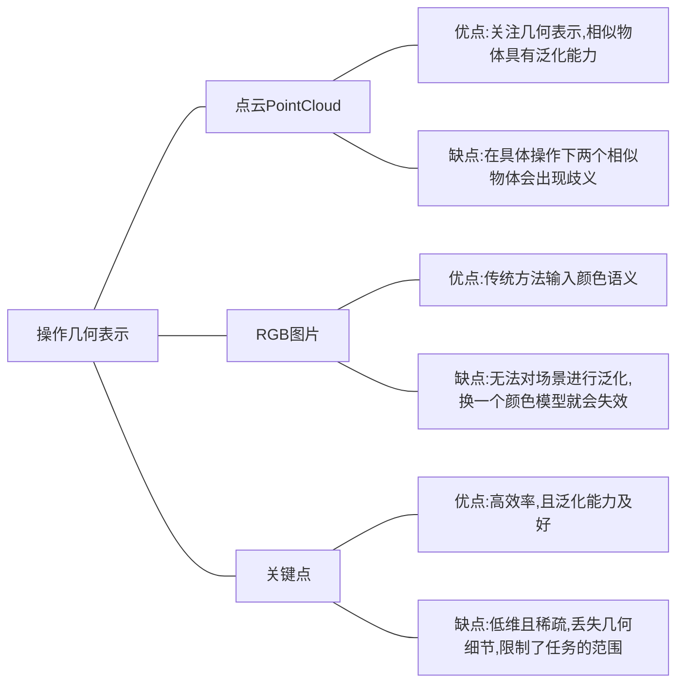

### 3D Sematic Fields - 3D语义场构建
* [GenDP: 3D Semantic Fields for Category-Level Generalizable Diffusion Policy](https://arxiv.org/html/2410.17488?_immersive_translate_auto_translate=1)
- [x]  3D语义构建场景模型
- [x]  DINOv2大型基础视觉模型进行视觉特征提取`backbone network`
- 三维描述符字段
    -  其中 $i \in {1, 2,...,N}$   代表视图索引
    -  取一个RGB图像$\boldsymbol{j}_i \in \mathbb{R}^{H \times W \times 3}$  和一个深度图像 $\boldsymbol{R}_i \in \mathbb{R}^{H \times W }$  
    -  使用`DINOv2`从RGB图像当中提取密集的2D特征图$\boldsymbol{W}_i$ 
    - 对于在3D点云的任意一个点$\boldsymbol{p}$ ，我们将其投影到图像空间并且找到对应的像素位置$\boldsymbol{u}_i$和到相机的距离$\boldsymbol{r}_i$，然后通过`插值`从特征图和深度$\boldsymbol{r}_i'$ 中推导出特征$\boldsymbol{f}_i$ 
- 多视角下权重
    -  深度差异$\Delta r_i = r'_i - r_i$反映了与表面的距离，当$p$ 在视图$i$ 中更靠近表面时，$f_i$ 的权重更大。我们通过应用加权求和融合多个视角的特征，从而获得对应$p$的描述符号$f$ 
    - 在实践中，遵循$\boldsymbol{D}^3$ 域中的实现细节来提取 点云$\boldsymbol{P} \in \mathbb{R}^{K \times 3}$  及其相关特征$\boldsymbol{f} \in \mathbb{R}^{K \times 3}$ ，其中$K$是点云的大小
- 3D 语义场
    -  
![[Pasted image 20250506160928.png]] 
![[Pasted image 20250506171012.png]]

