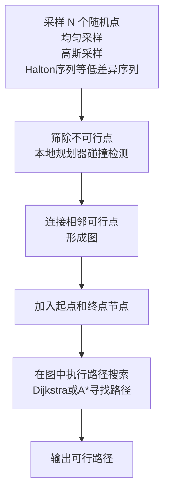

## 基于采样的规划方法
### [1996] PRM `一种用于静态工作空间中机器人运动规划的新方法`
* 路径规划领域的里程碑式工作，开创了 **采样型路径规划算法（Sampling-Based Motion Planning, SBMP）**,  尤其适用于 **高维空间中的机器人路径规划** 问题
* 该方法分为两个阶段： 学习阶段和查询阶段, 通过 `“采样+图搜索”`来在高维配置空间中完成机器人路径规划
* <iframe width="560" height="315" src="https://www.youtube.com/embed/RPzGEh6cOiM?si=N8LGsI3rxiv4fcfh" title="YouTube video player" frameborder="0" allow="accelerometer; autoplay; clipboard-write; encrypted-media; gyroscope; picture-in-picture; web-share" referrerpolicy="strict-origin-when-cross-origin" allowfullscreen></iframe>
* 前者学习阶段用于在空间中不断采样区域，最终采样完成后，查询当前最优的一条路径
* 算法流程如下：

### [1998] - RRT : Rapidly-exploring Random Trees: A New Tool for Path Planning
* 单次路径查询（Single-query）的问题、动态环境和高维空间路径规划
* `不同`：与PRM（Probabilistic Roadmap）相比，RRT 不需要提前构图，而是**在线生成一棵快速覆盖空间的树**，非常适合实时控制和复杂约束系统
* `核心思想` : 一种通过在配置空间中**随机采样**并将树快速扩展到未探索区域的方式来进行路径搜索的方法
* 算法流程如下
    * 定义初始状态$x_{init}$ ，目标状态$x_{goal}$ ， 状态空间（配置空间）$C$ ， 一个局部扩展器（如线性插值或动态模型）
     * Step1 : 初始化树
        * 初始树$T$  包含初始节点$x_{init}$ 
     * Step2 : 循环构建树
        * 采样：随机采样一个状态$x_{\text{rand}} \in \mathcal{C}$
        * 最近邻搜索：在当前树$T$ 中找到距离$x_{\text{rand}}$ 最近的节点$x_{\text{near}}$ 
        * 扩展(Steer)：从$x_{\text{near}}$ 沿$x_{\text{rand}}$ 的方向前进一个最大步长，得到新状态$x_{\text{new}}$ 
	    * 碰撞检测 ： 如果从$x_{\text{near}}$ 到$x_{\text{new}}$的路径无碰撞，则将$x_{\text{new}}$加入树中，并添加边$(x_{\text{near}},x_{\text{new}})$ 
	    * 终止判断：如果$x_{\text{new}}$ 接近$x_{\text{goal}}$ ，可以输出路径
    * Step3 ：返回路径
		* 从终点节点沿树回溯到起点，得到一条近似可行路径    
*  为什么叫“快速探索”
	*  稀疏区域的点在“最近邻”阶段更容易被扩展 → 促进空间快速均匀覆盖
	*  **快速扩展到大空间的边界和未访问区域**，尤其适合大尺度、高维度空间
![[Pasted image 20250624163407.png]]

### [2000] - RRT-Connect : An efficient approach to single-query path planning
*  核心目标：
	* 双向扩展：从起点$q_{\text{start}}$ 和目标点$q_{\text{goal}}$ 各自生成一棵RRT树
		* 直到两棵树连接完成 
	* Connect 操作：
	    * 原始RRT每次只扩展一小步(Steer) 
	    * RRT-Connect改为尽可能朝目标点连续扩展，直到碰撞为止，加速搜索过程
<iframe width="560" height="315" src="https://www.youtube.com/embed/cxyRDIBAIR0?si=xsb07kDFJMjPdnWP" title="YouTube video player" frameborder="0" allow="accelerometer; autoplay; clipboard-write; encrypted-media; gyroscope; picture-in-picture; web-share" referrerpolicy="strict-origin-when-cross-origin" allowfullscreen></iframe>

* 算法流程
	* 输入: 定义配置空间$\mathcal{C}$ ，起点$q_{\text{start}}$  和 终点$q_{\text{goal}}$ 
	* Step 1 ： 初始化两棵树
		* $T_{\text{start}}$  <-    $q_{\text{start}}$
		* $T_{\text{goal}}$   <-  $q_{\text{goal}}$ 
	* Step 2 ： 循环迭代直到两棵树相连
		* a. 从配置空间中采样一个随机点 $q_{\text{rand}}$  
		* b. $EXTEND(T_{a}, q_{\text{rand}})$ ：从树$T_a$ 向$q_{\text{rand}}$ 扩展（可能多步） 
		* c. 如果扩展成功：
			* 1)  令$q_{\text{new}}$ 变为新增节点
			* 2) 尝试$EXTEND(T_{b},q_{\text{new}})$ ： 让另一棵树连接过来
			* 3) 如果成功连接（碰撞检测无碍），路径完成
		* d. 交换$T_{a}$ 和$T_{b}$ 的角色，继续下一轮
	* Step 3 ：
		* 成功连接后，输出路径（从两棵树连接点向两端回溯） 
### [2001] - Sampling-based Algorithms for Optimal Motion Planning
* 最优的采样型路径规划方法 `RRT*`  和 `Informed RRT*`
* 
## 基于优化的规划方法