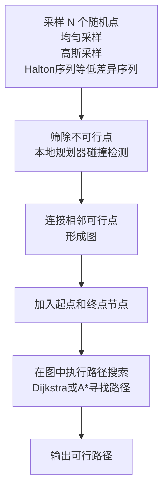

## 基于采样的规划方法
### [1996] PRM `一种用于静态工作空间中机器人运动规划的新方法`
* 路径规划领域的里程碑式工作，开创了 **采样型路径规划算法（Sampling-Based Motion Planning, SBMP）**,  尤其适用于 **高维空间中的机器人路径规划** 问题
* 该方法分为两个阶段： 学习阶段和查询阶段, 通过 `“采样+图搜索”`来在高维配置空间中完成机器人路径规划
* <iframe width="560" height="315" src="https://www.youtube.com/embed/RPzGEh6cOiM?si=N8LGsI3rxiv4fcfh" title="YouTube video player" frameborder="0" allow="accelerometer; autoplay; clipboard-write; encrypted-media; gyroscope; picture-in-picture; web-share" referrerpolicy="strict-origin-when-cross-origin" allowfullscreen></iframe>
* 前者学习阶段用于在空间中不断采样区域，最终采样完成后，查询当前最优的一条路径

### [1998] - RRT : Rapidly-exploring Random Trees: A New Tool for Path Planning
* 单次路径查询（Single-query）的问题、动态环境和高维空间路径规划
* 与PRM（Probabilistic Roadmap）相比，RRT 不需要提前构图，而是**在线生成一棵快速覆盖空间的树**，非常适合实时控制和复杂约束系统
* 
## 基于优化的规划方法